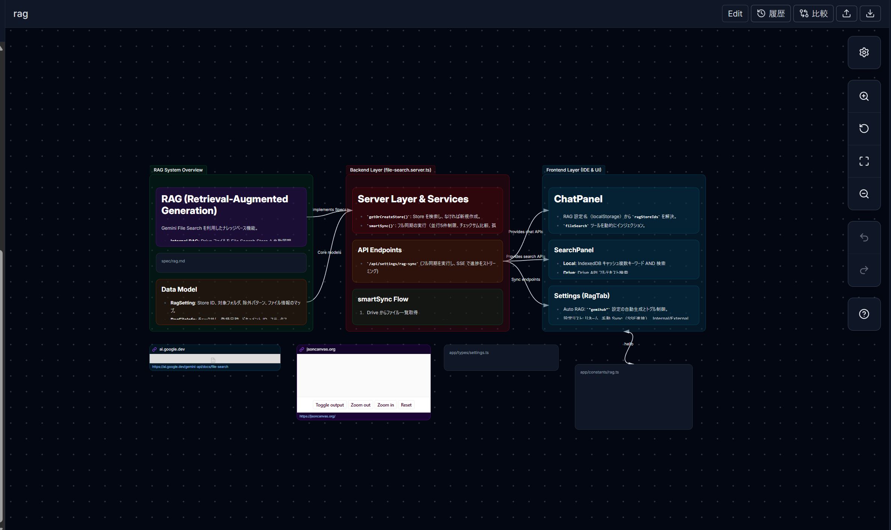

# GemiHub

**Your AI secretary, powered by Gemini and your own Google Drive.**

GemiHub is a self-hostable web application that turns Google Gemini into a personal AI assistant deeply integrated with your Google Drive. Chat with AI that can read, search, and write your files. Build automated workflows with a visual editor. All your data stays in your own Google Drive — no external database required.

[日本語版 README](./README_ja.md)


## Why GemiHub?

### Read, Highlight, and Memo — on Any Document

GemiHub turns your Drive into a reading-and-annotation workspace. Open a PDF, EPUB, Markdown, plain-text, or image file — in the main viewer or in a dashboard **File widget** — select a passage, right-click, and **Add to memo**. Every document gets its own memo timeline:

- **Quote-anchored highlights** — the selected quote is captured with surrounding context and painted in the document via the CSS Custom Highlight API. Anchors are quote-first, so highlights survive document edits and EPUB reflow.
- **Jump both ways** — click a highlight to jump to its memo; click the quote inside a memo to jump back to the exact passage (with a flash).
- **A real timeline** — write notes in a WYSIWYG or raw Markdown composer, then edit, delete, and pin entries. Wiki links and embeds resolve and open in the IDE. The panel collapses to a narrow rail so highlights stay visible while you read.
- **Memo List widget** — browse every annotated document on a dashboard: memo counts, the newest note at a glance (a final "done reading" is instantly visible), filtering and paging, one click to reopen the source.
- **Plain Markdown storage** — memos are ordinary Markdown files under `Dashboards/Memos/` in your own Drive. Portable, searchable, syncable — and since they're just files, the AI chat and RAG can use them too.

The built-in **pdf.js PDF viewer** (selectable text, page navigation, zoom) and **EPUB reader** (client-side unpacking, font-size and page-width controls) make GemiHub a genuinely comfortable place to read the documents you annotate.


### Your Personal Dashboard

The home screen is a customizable dashboard. Arrange widgets — **File** viewers (Markdown, PDF, EPUB, HTML, text, and images, each with the per-document memos described above), a **Memo List**, **Base** views (Obsidian Bases), kanban boards, an encrypted **Secret Manager**, a **Timeline** microblog, workflow output, and embedded web pages — on a drag-and-drop grid. Add, configure, resize, maximize, and rearrange widgets directly from hover-revealed controls, with undo/redo support; one-click **align** buttons tile all widgets evenly into columns or rows. Create multiple dashboards, switch between them, and pin one as your home. **Base widgets** render a view of an Obsidian-style `.base` file — a saved query (filter/sort/limit, computed properties) over a folder of Markdown notes, shown as a table, card grid, or list; the older card/table/file-list widgets are now authored this way (legacy widgets can be converted to a `.base` from their settings). **Kanban widgets** use reusable `.kanban` YAML definition files, support configurable card fields and temporary tag filtering, and write card creation or status changes straight back to the source Markdown files. The **Timeline widget** is a personal microblog: post short notes with `#tags`, wiki links, image attachments, AI-assisted rewrites with model selection, pin/edit actions, and tag/word/date filters — each day is stored as a Markdown file under `Dashboards/Timeline/`. Workflow widgets run a GemiHub workflow and render its output as cards, a table, Markdown, or HTML — with optional auto-refresh. Each dashboard is saved as a `.dashboard` file in your Drive, with both a rendered view and a raw YAML view.


### Keep Secrets Encrypted in Your Drive

Add a **Secret Manager widget** to create, browse, unlock, copy, and update encrypted values without leaving your dashboard. Secrets are stored as self-contained `.encrypted` files in a configurable Drive folder, can be organized into nested directories, and remain part of the same local-first Push/Pull workflow as your other files. Search works across file names, descriptions, and optional visible fields such as an account email.

Secret values are protected by GemiHub's RSA + AES encryption. Names, descriptions, and visible fields are intentionally stored outside the ciphertext so they can be listed and searched before unlocking; do not put secret values in those fields. Configure encryption in Settings before creating a secret.


### AI That Knows Your Data

Unlike generic AI chat, GemiHub connects directly to your Google Drive. The AI can read your files, search across them, create new documents, and update existing ones — all through natural conversation. Ask questions about your notes, generate summaries of your documents, or have the AI organize your files for you.

### Search by Meaning, Not Just Keywords (RAG)

With built-in RAG (Retrieval-Augmented Generation), you can sync your Drive files to Gemini's semantic search. Instead of matching exact keywords, the AI understands the **meaning** of your question and finds relevant information from your personal knowledge base. Store product manuals, meeting notes, or research papers — then just ask questions in natural language.

You can also use **OKF (Open Knowledge Format) bundles** — Markdown-based knowledge bases on your Drive (concepts, metrics, glossaries, playbooks) — as chat knowledge: set the OKF parent folder in the RAG settings tab, then pick which bundles to use per chat from the selector above the chat input. See [docs/references/OKF.md](./docs/references/OKF.md).


The AI can even author bundles for you: install the **OKF Authoring** external skill and ask it to turn a folder of notes into an OKF bundle.


### Connect Any External Tool (MCP & Plugins)

Through the Model Context Protocol (MCP), GemiHub can talk to external services. Connect web search, databases, APIs, or any MCP-compatible server — and the AI automatically discovers and uses these tools during conversation. You can also extend GemiHub with **plugins** — install from GitHub or develop locally — to add custom sidebar views, slash commands, and settings panels. The Plugins settings also offer **External skills**: Agent Skills installed with one click from the official catalog.


### No-Code Workflow Automation

Build complex automation pipelines with a visual editor. Chain together AI prompts, Drive file operations, HTTP requests, user input dialogs, and more. Workflows are stored as YAML, support loops and conditionals, and run in real-time with streaming output.


### Obsidian-Compatible Canvas

Create and view `.canvas` files using an Obsidian-compatible JSON Canvas editor. GemiHub renders text cards, groups, file previews, web pages, and curved links, with read-only viewing by default and an edit mode for arranging cards, connecting objects, changing colors, and updating Markdown content.



### Your Data, Your Control

All data — chat history, workflows, settings, edit history — is stored in your own Google Drive under a `gemihub/` folder. No proprietary database, no vendor lock-in. Optional hybrid encryption (RSA + AES) protects sensitive files. A Python decryption script is provided so you can always access your encrypted data independently.

### Works Offline, Syncs on Your Terms

GemiHub is offline-first. All your files are cached in the browser's IndexedDB, so they load instantly — even without an internet connection. Create and edit files offline, and your changes are tracked automatically. When you're back online, push your changes to Google Drive with one click. If someone else edited the same file, GemiHub detects the conflict and lets you choose which version to keep, with the other safely backed up.


### Obsidian Integration

GemiHub works with [GemiHub - Drive Sync](https://github.com/takeshy/obsidian-gemihub), an Obsidian plugin that syncs your vault with Google Drive. Edit notes in Obsidian and access them from GemiHub's web interface, or vice versa — both sides share the same `_sync-meta.json` format for seamless bidirectional sync.

**GemiHub-exclusive features** that the Obsidian plugin alone cannot replicate:
- **Automatic RAG** — Files synced to GemiHub are automatically indexed for semantic search
- **OAuth2-enabled MCP** — Use MCP servers that require OAuth2 authentication (e.g., Google Calendar, Gmail)
- **Markdown to PDF/HTML conversion** — Convert Markdown notes to formatted PDF or HTML
- **Public publishing** — Publish documents with a shareable public URL

**Features added to Obsidian** through the connection:
- Bidirectional sync with diff preview
- Conflict resolution with color-coded unified diff
- Drive edit history tracking changes from both Obsidian and GemiHub
- Conflict backup management

## Screenshots

### Dashboard Editing

Add widgets from the palette, then drag, resize, and configure them directly — no edit mode to switch into. Changes are saved automatically to a `.dashboard` file in your Drive.


### Workflow Node Editing

Edit workflow nodes with a form-based UI. Configure LLM prompts, models, Drive file operations, and more.


### Workflow Execution

Run workflows and see real-time streaming output with execution logs.


### AI Workflow Generation

Create and modify workflows using natural language. AI generates the YAML with streaming preview and thinking display.


### File Management

Manage Drive files with a context menu — publish to web, view history, encrypt, rename, download, and more.


## Features

- **Document Memos** — Per-document memo timelines on Markdown, PDF, EPUB, text, and image files, in both the IDE viewers and dashboard File widgets. Select text → right-click → Add to memo; quote-anchored highlights (CSS Custom Highlight API) jump both ways between document and memo. Pin/edit/delete, WYSIWYG or raw composer, wiki links. Stored as plain Markdown under `Dashboards/Memos/`, local-first with Push sync
- **PDF & EPUB Viewers** — pdf.js-based PDF viewer with selectable text, page navigation, and zoom; client-side EPUB reader with font-size/page-width controls — both in the IDE and in dashboard File widgets
- **Customizable Dashboard** — Drag-and-drop widget grid as your home screen: **File** widgets that open a Drive file — Markdown (preview/WYSIWYG/code), text, HTML, EPUB, PDF, or image — with per-document memos, a **Memo List** widget that browses all annotated documents (newest-note preview, filter/paging, jump to source), **Base** widgets that render a view (table/cards/list) of an Obsidian-style `.base` query file over a folder of Markdown notes (the former card/table/file-list widgets are now authored as Bases, with conversion available for legacy widgets), `.kanban`-backed boards (new card creation and in-modal editing, configurable display fields, temporary tag filtering, optional unmatched-status column, drag-to-restatus written back to `.md` files), an encrypted **Secret Manager**, a **Timeline** microblog widget (dated posts with `#tags`/wiki links/image attachments, AI rewrite with model selection, pin/edit, tag/word/date filtering, configurable folding, stored under `Dashboards/Timeline/`), workflow widgets that run a workflow and render its output (cards/table/Markdown/HTML, with optional auto-refresh), and web embeds. Multiple dashboards with hover-revealed drag/resize/maximize/open/settings/delete controls, undo/redo, one-click column/row alignment, home pinning, and a rendered/raw YAML toggle
- **Secret Manager** — Create and manage RSA + AES encrypted values from a dashboard widget. Organize `.encrypted` files into folders, search by name/description/visible metadata, unlock and copy values, and edit them in place. Secret values are encrypted; names and searchable metadata remain visible before unlock
- **AI Chat** — Streaming conversations with Gemini, function calling, thinking display, image generation, file attachments. Paid plan uses the Interactions API for simultaneous function tools + RAG + Web Search and conversation chaining
- **Slash Commands** — User-defined `/commands` with template variables (`{content}`, `{selection}` with file ID & position), `@file` mentions (resolved to Drive file IDs for tool access), per-command model/tool overrides. `/run @workflow.yaml` executes workflows directly from chat with inline streaming logs
- **Visual Workflow Editor** — Visual node-based builder (30 node types), YAML import/export, real-time SSE execution
- **AI Workflow Generation** — Create and modify workflows via natural language with streaming preview and diff view
- **Keyboard Shortcuts** — Configurable shortcuts with modifier key support (Ctrl/Cmd, Shift, Alt) via Settings
- **RAG** — Sync Drive files to Gemini File Search for context-aware AI responses
- **OKF Knowledge Sources** — Open Knowledge Format bundles (Markdown knowledge bases on Drive); set the parent folder in the RAG settings tab and pick active bundles per chat
- **MCP** — Connect external MCP servers as tools for AI chat, with OAuth support and rich UI rendering (MCP Apps)
- **Agent Skills** — User-defined AI agent configurations with custom instructions, reference materials, and executable workflows stored on Drive. Skill workflows run as headless chat tools: return variables to chat instead of relying on dialogs
- **Plugins** — Install from GitHub or develop locally; API for custom views, slash commands, settings panels, custom file icons, and file extension handling
- **Google Drive Integration** — All data stored in your own Drive, no external database
- **Rich Markdown Editor** — WYSIWYG file editing powered by wysimark-lite
- **Canvas Editor** — Obsidian-compatible JSON Canvas viewing and editing with file/link previews, groups, curved connections, read-only mode, and edit controls
- **Offline Cache & Sync** — Offline-first with IndexedDB caching. Edit files without internet, then Push/Pull to sync with Drive. Automatic conflict detection and resolution with backup. Soft delete with trash recovery. Temp UP/DL lets you preserve specific files across a Pull — upload before pulling, then download to restore. External sync token for tools like Obsidian
- **Encryption** — Optional hybrid RSA + AES encryption for individual files, chat history, and workflow logs
- **Edit History** — Unified diff-based change tracking for workflows and Drive files
- **Multi-Model Support** — Curated Gemini and Gemma model lists including Gemini 3.1 Pro, Gemini 3.5 Flash, Gemini 3.1 Flash Lite, Gemini image models, and Gemma 4
- **Image Generation** — Generate images via Gemini image models
- **i18n** — English and Japanese UI

## Documentation

Detailed documentation is available in the [`docs/`](./docs/) directory, organized as an OKF (Open Knowledge Format) bundle — see [docs/index.md](./docs/index.md) for the full table of contents:

| Topic | Document |
|-------|----------|
| Chat & AI | [features/chat.md](./docs/features/chat.md) |
| Dashboard (widgets, memos) | [features/dashboard.md](./docs/features/dashboard.md) |
| Editor | [features/editor.md](./docs/features/editor.md) |
| Search | [features/search.md](./docs/features/search.md) |
| Sync & Offline Cache | [features/sync.md](./docs/features/sync.md) |
| Edit History | [features/history.md](./docs/features/history.md) |
| MCP | [integrations/mcp.md](./docs/integrations/mcp.md) |
| Plugins | [integrations/plugins.md](./docs/integrations/plugins.md) |
| RAG | [integrations/rag.md](./docs/integrations/rag.md) |
| Agent Skills | [integrations/skill.md](./docs/integrations/skill.md) |
| Workflow Execution Engine | [workflows/workflow_execution.md](./docs/workflows/workflow_execution.md) |
| Workflow Node Reference | [workflows/workflow_nodes.md](./docs/workflows/workflow_nodes.md) |
| Infrastructure | [architecture/infrastructure.md](./docs/architecture/infrastructure.md) |
| Premium Plan | [architecture/premium.md](./docs/architecture/premium.md) |
| Encryption | [architecture/encryption.md](./docs/architecture/encryption.md) |
| Utils (Context Menu, Trash, Commands) | [architecture/utils.md](./docs/architecture/utils.md) |
| OKF Knowledge Sources | [references/OKF.md](./docs/references/OKF.md) |

## Getting Started

### Prerequisites

- Node.js 24+
- Google Cloud project (see setup below)
- Gemini API key

### 1. Google Cloud Setup

Go to [Google Cloud Console](https://console.cloud.google.com/) and perform the following steps:

#### Create a project
1. Click "Select a project" at the top left → "New Project" → name it and create

#### Enable Google Drive API
1. Go to "APIs & Services" → "Library"
2. Search for "Google Drive API" and click "Enable"

#### Configure OAuth consent screen
1. Go to "APIs & Services" → "OAuth consent screen"
2. User Type: **External**
3. Fill in App name (e.g., GemiHub), support email, and developer contact
4. Add scope: `https://www.googleapis.com/auth/drive.file`
5. Add your Gmail address as a test user (only your account can access before publishing)

> **Important: Google Drive File Access**
>
> This app uses the `drive.file` scope, which means it can **only access files created by the app itself**. Files you upload directly to the `gemihub/` folder via the Google Drive web UI or other apps will **not** be visible to GemiHub. To add files, use the upload feature within the app or create them through AI chat.

#### Create OAuth credentials
1. Go to "APIs & Services" → "Credentials" → "+ Create Credentials" → "OAuth client ID"
2. Application type: **Web application**
3. Name: anything (e.g., GemiHub Local)
4. Add **Authorized redirect URI**: `http://localhost:8132/auth/google/callback`
5. Copy the **Client ID** and **Client Secret**

### 2. Get a Gemini API Key

1. Go to [Google AI Studio](https://aistudio.google.com/)
2. Left menu → "API keys" → "Create API key"
3. Copy the key (you'll enter it in the app's Settings page later)

> **Free vs. Paid API:** The free Gemini API tier has strict rate limits and restricted model access — enough for a quick test, but not for regular use. For the full experience, you'll need a paid plan. [Google AI Pro](https://one.google.com/about/ai-premium) ($19.99/month) is a great option: it includes $10/month in Google Cloud credits that cover extensive Gemini API usage, plus 2 TB Google One storage, Gemini Code Assist, and more. See [Gemini API Pricing](https://ai.google.dev/pricing) for details.

### 3. Clone and install

```bash
git clone <repository-url>
cd gemihub
npm install
```

### 4. Configure environment

```bash
cp .env.example .env
```

Edit `.env`:

```env
GOOGLE_CLIENT_ID=your-client-id.apps.googleusercontent.com
GOOGLE_CLIENT_SECRET=GOCSPX-your-client-secret
GOOGLE_PICKER_API_KEY=your-browser-api-key
GOOGLE_REDIRECT_URI=http://localhost:8132/auth/google/callback
SESSION_SECRET=<random string>
# Optional: managed GemiHub OKF distribution in private Cloud Storage
GEMIHUB_OKF_BUCKET=<bucket-name>
GEMIHUB_OKF_PREFIX=gemihub-okf
```

To generate `SESSION_SECRET`:

```bash
openssl rand -hex 32
```

### 5. Start development server

```bash
npm run dev
```

### 6. First-time setup

1. Open `http://localhost:8132` in your browser
2. Click "Sign in with Google" → authorize with your Google account
3. Click the gear icon (Settings) in the top right
4. In the **General** tab, enter your Gemini API Key and click Save

Chat, workflows, and file editing are now ready to use.

> **Note:** The dev server port is configured to `8132` in `vite.config.ts`. To change it, update both the config and the redirect URI in `.env` and Google Cloud Console.

## Production

### Build

```bash
npm run build
npm run start
```

### Docker

```bash
docker build -t gemihub .
docker run -p 8080:8080 \
  -e GOOGLE_CLIENT_ID=... \
  -e GOOGLE_CLIENT_SECRET=... \
  -e GOOGLE_PICKER_API_KEY=... \
  -e GOOGLE_REDIRECT_URI=https://your-domain/auth/google/callback \
  -e SESSION_SECRET=... \
  gemihub
```

## Paid Plans

Two paid plans extend GemiHub with Google Sheets/Gmail integration and web app builder capabilities. See [docs/architecture/premium.md](docs/architecture/premium.md) for full details.

### Lite (¥300/month)

| Feature | Description |
|---------|-------------|
| **Gmail Send** | Workflow node: `gmail-send`. Send emails via Gmail API |
| **PDF Generation** | Convert Markdown/HTML to PDF |
| **Upload Limit Removed** | Free plan has 20MB limit; Lite and Pro have no practical limit |
| **External Sync Token** | Export token for external clients like Obsidian |
| **Temp Edit URL** | Generate temporary URLs for external editor integration |
| **Interactions API Chat** | Chat uses the Gemini Interactions API: function tools + RAG + Web Search simultaneously, conversation chaining via `previous_interaction_id` |

### Pro (¥2,000/month)

All Lite features, plus:

| Feature | Description |
|---------|-------------|
| **Google Sheets CRUD** | Workflow nodes: `sheet-read`, `sheet-write`, `sheet-update`, `sheet-delete` |
| **File-Based Page Hosting** | Place files in `web/` on Drive — served directly via Drive API + CDN with file-based routing and `[param]` dynamic routes |
| **Built-in Subdomain** | `{slug}.gemihub.net` available immediately on account creation |
| **Custom Domains** | Optional per-account domain with auto-provisioned SSL via Certificate Manager |
| **Multi-Type Auth** | Multiple account types (e.g., "talent", "company") with independent magic link sessions per type |
| **Workflow API** | YAML workflows in `web/api/` exposed as JSON endpoints via `/__gemihub/api/*`, with form POST support |
| **Client Helper** | `/__gemihub/api.js` provides `gemihub.get()`, `gemihub.post()`, and `gemihub.auth.*` for frontend integration |
| **AI Web Builder Skill** | Auto-provisioned "Webpage Builder" skill lets AI create pages and APIs via chat |
| **Server-Side Execution** | All node types run server-side, including `script` (via `isolated-vm`) |
| **Scheduled Workflows** | Cron-based multi-tenant execution via Cloud Scheduler + Firestore with deferred retry |

### Architecture

```
Load Balancer + Cloud CDN + Certificate Manager
  ├── *.gemihub.net     → Cloud Run (wildcard subdomain)
  ├── app.acme.com         → Cloud Run (custom domain)
  └── app.other.com        → Cloud Run (same backend)

Cloud Run (single instance, multi-tenant)
  ├── GemiHub IDE (free features)
  ├── Premium API (per-account, resolved by Host header)
  ├── Page proxy (file-based routing from Drive, CDN-cached)
  ├── Scheduled workflow execution
  └── isolated-vm (server-side script execution)

Firestore
  ├── accounts + tokens
  ├── scheduleIndex + runtime
  ├── form submissions (TTL)
  └── magic link tokens (TTL)
```

### Workflow Nodes (Paid Only)

| Node | Description |
|------|-------------|
| `sheet-read` | Read rows with optional filter and limit |
| `sheet-write` | Append rows to a sheet |
| `sheet-update` | Update rows matching a filter |
| `sheet-delete` | Delete rows matching a filter |
| `gmail-send` | Send email via Gmail API |

### Setup

1. Subscribe via the **Settings > Premium Plan** tab — choose your subdomain slug
2. Premium features are automatically enabled after subscription
3. Configure account types and Sheets integration in `settings.json` (`accounts` with identity/data config)
4. Optionally set a custom domain — DNS records and SSL certificates are provisioned automatically
5. Place HTML/CSS/JS files in `web/` and workflow APIs in `web/api/` — Push to publish

## Architecture

| Layer | Tech |
|-------|------|
| Frontend | React 19, React Router 7, Tailwind CSS v4, Mermaid |
| Backend | React Router server (SSR + API routes) |
| AI | Google Gemini API (`@google/genai`) |
| Storage | Google Drive API, Firestore |
| Auth | Google OAuth 2.0 → session cookies |
| Infrastructure | Cloud Run, Cloud Build, Artifact Registry, Cloud DNS, Certificate Manager, Cloud Scheduler, Global HTTPS LB + CDN |
| Editor | wysimark-lite (Slate-based WYSIWYG) |

## License

MIT
