# GemiHub

**Gemini と Google Drive で作る、あなた専用のAI秘書。**

GemiHub は、Google Gemini を Google Drive と深く統合したセルフホスト対応の Web アプリケーションです。AI があなたのファイルを読み・検索し・書き込める。ビジュアルエディタでワークフローを自動化できる。すべてのデータはあなた自身の Google Drive に保存され、外部データベースは不要です。

**[gemihub.net で今すぐ試す →](https://gemihub.net)**

[English README](./README.md)

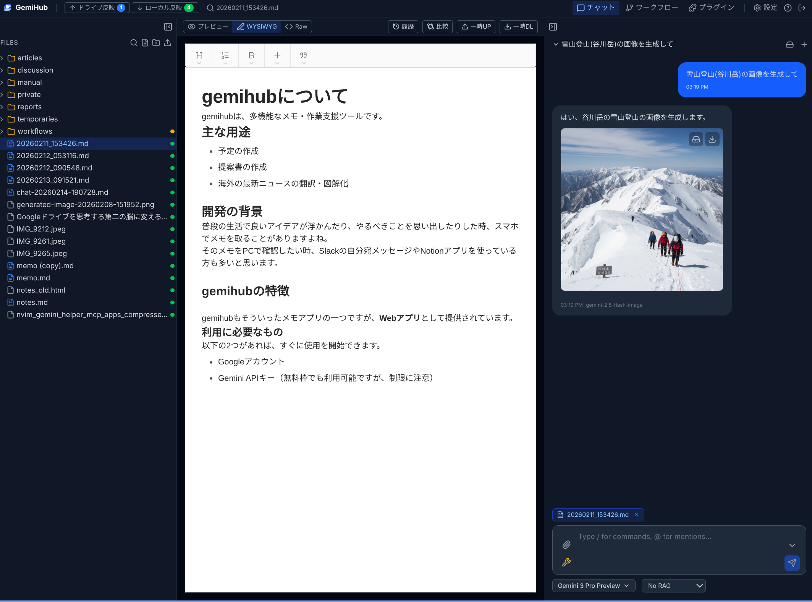

## GemiHub でできること

### どんなドキュメントにも、読みながらメモを

GemiHub は Drive を「読んで、線を引いて、メモを残す」ワークスペースに変えます。PDF・EPUB・Markdown・テキスト・画像を、メインビューアでもダッシュボードの **File ウィジェット**でも開いて、文章を選択して右クリック →「メモに追加」。ドキュメントごとに専用のメモタイムラインが付きます。

- **引用アンカー付きハイライト** — 選択した引用が前後の文脈とともに記録され、CSS Custom Highlight API でドキュメント上にハイライト表示されます。アンカーは引用文字列が主体なので、ドキュメントの編集や EPUB のリフローでもハイライトが失われません。
- **双方向ジャンプ** — ハイライトをクリックするとメモへ、メモ内の引用をクリックすると本文の該当箇所へ（フラッシュ表示付きで）ジャンプします。
- **本格的なタイムライン** — WYSIWYG / 生 Markdown 両対応のコンポーザーでノートを書き、編集・削除・ピン留めが可能。wiki リンクや埋め込みも解決され、IDE で開けます。パネルは細いレールに折り畳めるので、ハイライトを表示したまま読書に集中できます。
- **Memo List ウィジェット** — メモを付けた全ドキュメントをダッシュボードで一覧。メモ件数と最新メモの冒頭（「読了」などの最後のひとことが一目で分かる）、絞り込み・ページング、ワンクリックで元ドキュメントを開けます。
- **プレーンな Markdown 保存** — メモは Drive の `Dashboards/Memos/` 配下の普通の Markdown ファイル。ポータブルで、検索も同期も自由自在 — ただのファイルなので AI チャットや RAG からも活用できます。

組み込みの **pdf.js PDF ビューア**（テキスト選択、ページナビ、ズーム）と **EPUB リーダー**（クライアントサイド展開、フォントサイズ・ページ幅調整）により、メモを付けたいドキュメントを快適に読めます。

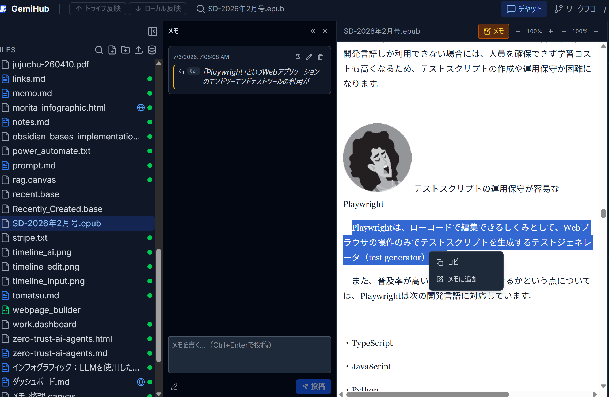

### あなた専用のダッシュボード

ホーム画面はカスタマイズ可能なダッシュボードです。**File** ビューア（Markdown・PDF・EPUB・HTML・テキスト・画像。それぞれに上記のドキュメントメモ付き）、**Memo List**、**Base** ビュー（Obsidian Bases）、カンバンボード、暗号化された **Secret Manager**、**タイムライン**マイクロブログ、ワークフロー出力、Web ページ埋め込みといったウィジェットを、ドラッグ＆ドロップのグリッド上に自由に配置できます。モード切り替え不要で、ホバー時に現れる操作からウィジェットの追加・設定・リサイズ・最大化・並べ替えができ、Undo / Redo にも対応します。ワンクリックの**整列**ボタンで全ウィジェットを列方向・行方向に均等に並べ直せます。複数のダッシュボードを作成して切り替えたり、ホームに固定したりできます。**Base ウィジェット**は Obsidian 風の `.base` ファイル（フォルダ内 Markdown ノートに対するフィルタ／ソート／件数制限・算出プロパティを保存したクエリ）の指定ビューを、テーブル・カードグリッド・リストとして描画します。従来のカード／テーブル／ファイル一覧ウィジェットはこの Base 形式で作成するようになり、既存のレガシーウィジェットは設定画面から変換できます。**Kanban ウィジェット**は再利用可能な `.kanban` YAML 定義ファイルを使い、カードの表示項目や一時的なタグ絞り込みを設定できます。カードの新規作成やステータス列間のドラッグは、元の Markdown ファイルへ書き戻されます。**タイムラインウィジェット**は個人用のマイクロブログで、`#タグ`、wiki リンク、画像添付つきの短い投稿、モデル選択つき AI 書き換え、投稿のピン留め・編集、タグ／キーワード／日付でのフィルタに対応し、日付ごとに `Dashboards/Timeline/` 配下の Markdown ファイルとして保存されます。ワークフローウィジェットは GemiHub のワークフローを実行し、その出力をカード・テーブル・Markdown・HTML として描画します（任意で自動更新）。各ダッシュボードは Drive 上の `.dashboard` ファイルとして保存され、レンダリング表示と生の YAML 表示を切り替えられます。

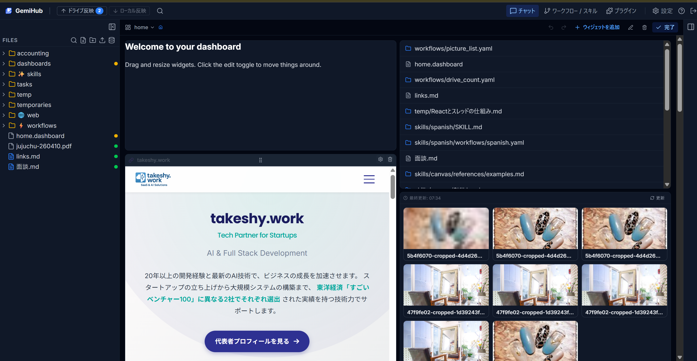

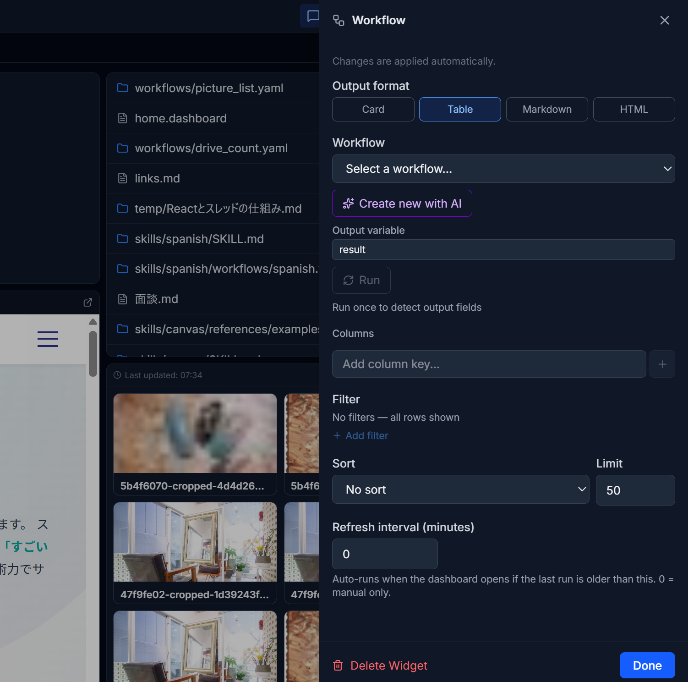


タイムラインの変更時はDriveの最新版を先に読み、チェックサム競合をリトライして即時更新します。ウィジェットのヘッダーから手動で再読み込みもできます。


### シークレットを Drive 上で暗号化して管理

ダッシュボードに **Secret Manager ウィジェット**を追加すると、画面を離れずにシークレット値の作成・一覧・ロック解除・コピー・更新ができます。シークレットは設定した Drive フォルダに自己完結型の `.encrypted` ファイルとして保存され、サブディレクトリで整理できます。ほかのファイルと同じローカルファーストの Push / Pull 対象です。ファイル名・説明・アカウントメールなどの公開フィールドから検索できます。

シークレット値は GemiHub の RSA + AES 暗号化で保護されます。ファイル名・説明・公開フィールドは、ロック解除前に一覧・検索できるよう意図的に暗号文の外側へ保存されるため、これらの項目には秘密の値を入力しないでください。シークレットを作成する前に、設定画面で暗号化を構成します。

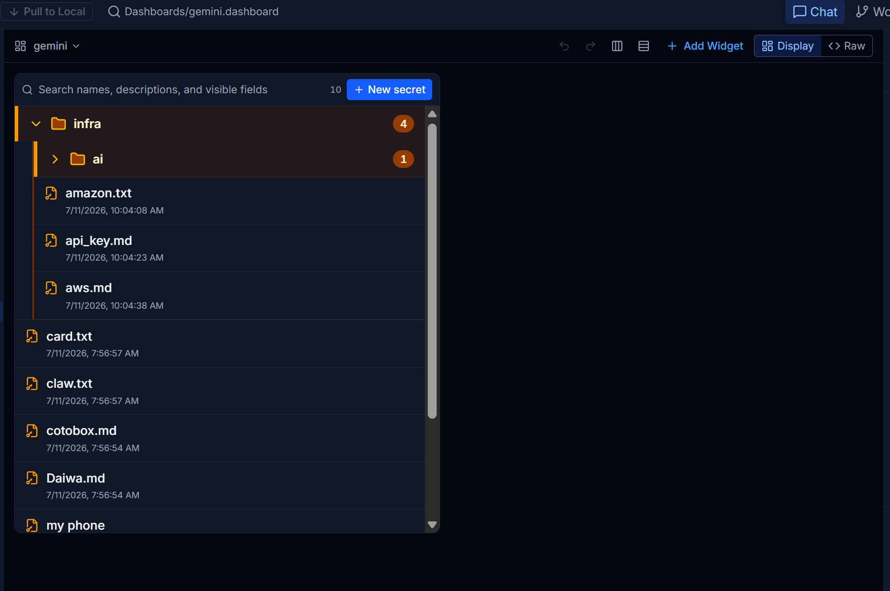

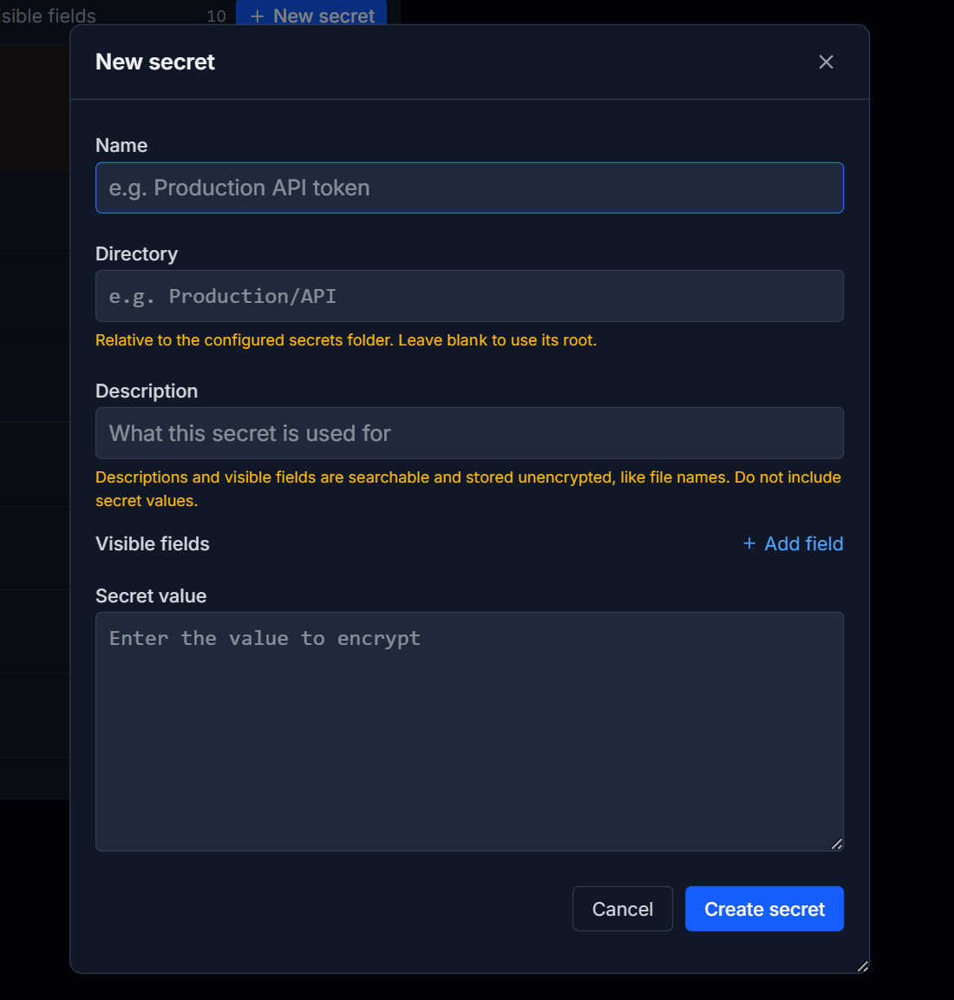

### あなたのデータを理解する AI

一般的な AI チャットとは違い、GemiHub はあなたの Google Drive に直接つながります。AI がファイルを読み取り、横断検索し、新規作成や更新まで — すべて自然な会話で行えます。メモの内容を質問したり、ドキュメントの要約を生成したり、ファイル整理を任せたり。

### 単語ではなく「意味」で検索する（RAG）

組み込みの RAG（検索拡張生成）により、Drive ファイルを Gemini のセマンティック検索に同期できます。キーワードの完全一致ではなく、質問の**意味**を理解して、あなたの個人的なナレッジベースから関連情報を見つけ出します。製品マニュアル、議事録、調査資料を保存しておけば、自然な言葉で質問するだけで答えが返ってきます。

さらに、Drive 上の Markdown 製ナレッジベース（概念・メトリクス・用語集・プレイブックなど）を **OKF（Open Knowledge Format）バンドル**としてチャットのナレッジに使えます。設定の RAG タブで OKF の親フォルダを指定しておき、どのバンドルを使うかはチャット入力欄の上のセレクタでチャットごとに選択します。GemiHub は選択した各バンドルの `index.md` をチャットのコンテキストに保持し、AI は組み込みの `read_okf_document` ツールを使って、必要な参照文書だけを全文取得します（詳細は [docs/references/OKF.md](./docs/references/OKF.md)）。

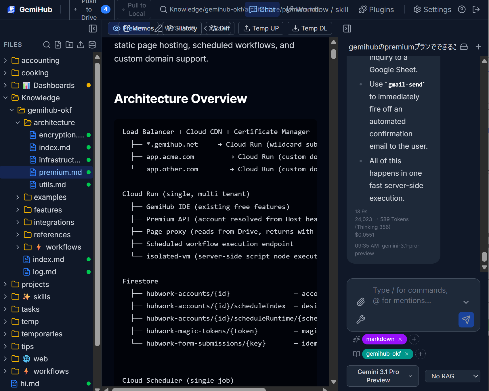

バンドルの作成も AI におまかせできます。**OKF Authoring** 外部スキルをインストールして、ノートのフォルダを OKF バンドルに変換するよう依頼するだけです。

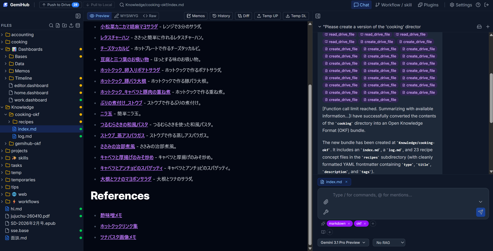

### 外部ツールを自由に接続（MCP & プラグイン）

Model Context Protocol（MCP）を通じて、GemiHub は外部サービスと連携できます。Web 検索、データベース、API、MCP 対応サーバーを接続すれば、AI が会話中にこれらのツールを自動的に発見し活用します。さらに**プラグイン**で機能を拡張可能 — GitHub からインストールまたはローカル開発で、カスタムサイドバービュー、スラッシュコマンド、設定パネルを追加できます。プラグイン設定には **External skills** もあり、公式カタログから Agent Skills をワンクリックでインストールできます。

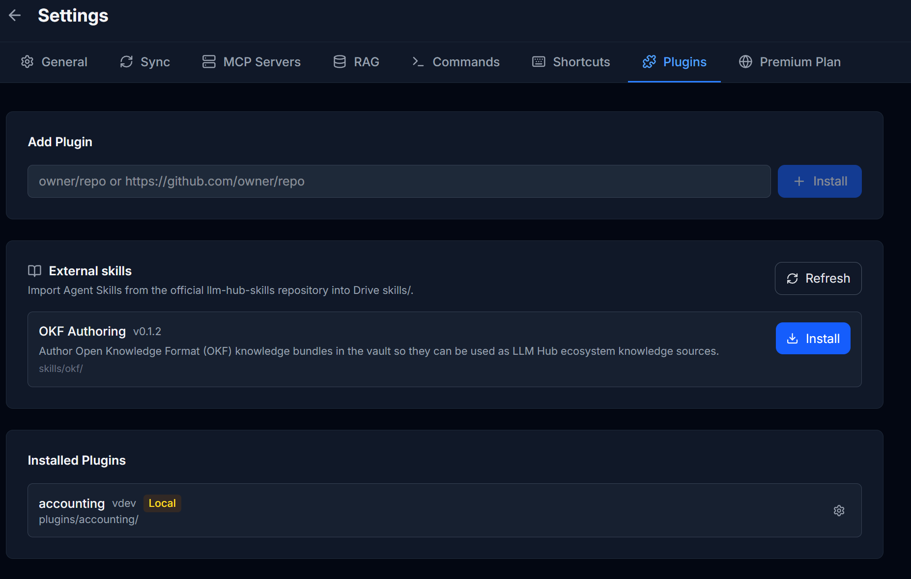

### コード不要のワークフロー自動化

ビジュアルエディタで複雑な自動化パイプラインを構築できます。AI プロンプト、Drive ファイル操作、HTTP リクエスト、ユーザー入力ダイアログなどを連結。ワークフローは YAML で保存され、ループや条件分岐をサポートし、ストリーミングでリアルタイム実行されます。自然言語による AI ワークフロー生成にも対応しています。


### あなたのデータは、あなたの管理下に

チャット履歴、ワークフロー、設定、変更履歴 — すべてのデータは Google Drive の `gemihub/` フォルダに保存されます。独自データベースもベンダーロックインもありません。オプションのハイブリッド暗号化（RSA + AES）で機密ファイルを保護でき、Python 復号スクリプトも提供されているため、暗号化データには常に独立してアクセスできます。

### オフラインでも使える、同期はあなたのペースで

GemiHub はオフラインファーストです。すべてのファイルはブラウザの IndexedDB にキャッシュされるため、インターネット接続がなくても瞬時に表示されます。オフラインでファイルの作成・編集ができ、変更は自動的に追跡されます。オンラインに戻ったら、ワンクリックで Google Drive に Push。同じファイルが別の場所で編集されていた場合はコンフリクトを検出し、どちらのバージョンを残すか選べます（選ばなかった方は自動でバックアップ）。

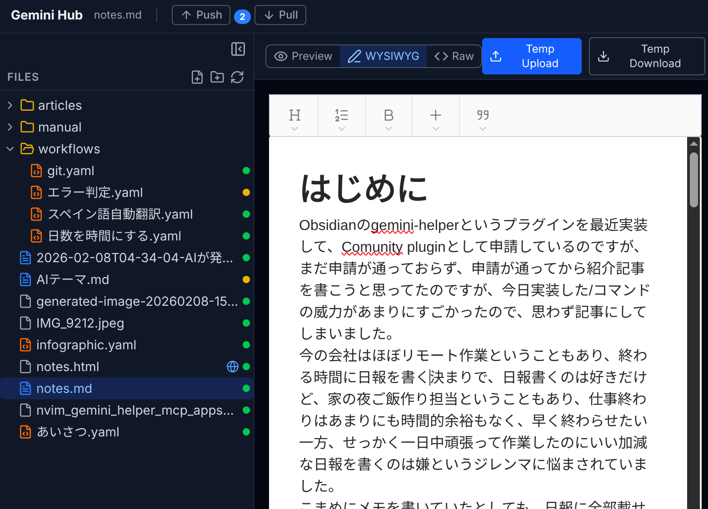

### Obsidian 連携

GemiHub は Obsidian プラグイン [GemiHub - Drive Sync](https://github.com/takeshy/obsidian-gemihub) と連携できます。Obsidian で書いたノートを GemiHub の Web インターフェースからアクセスしたり、その逆も可能。両者は同じ `_sync-meta.json` 形式を共有し、シームレスな双方向同期を実現します。

**GemiHub でしか使えない機能**（Obsidian プラグイン単体では再現できない機能）:
- **自動 RAG** — GemiHub に同期されたファイルは自動的にセマンティック検索にインデックスされる
- **OAuth2 対応 MCP** — OAuth2 認証が必要な MCP サーバー（Google Calendar、Gmail など）を利用可能
- **Markdown → PDF/HTML 変換** — Markdown ノートをフォーマット済み PDF や HTML に変換
- **Web 公開** — 共有可能な公開 URL でドキュメントを公開

**連携により Obsidian 側に追加される機能**:
- diff プレビュー付きの双方向同期
- カラー表示の unified diff によるコンフリクト解決
- Obsidian・GemiHub 双方の変更を追跡する Drive 編集履歴
- コンフリクトバックアップの管理

## スクリーンショット

### ダッシュボード編集

パレットからウィジェットを追加し、そのままドラッグ・リサイズ・設定を行います（編集モードへの切り替えは不要）。変更は Drive 上の `.dashboard` ファイルに自動保存されます。

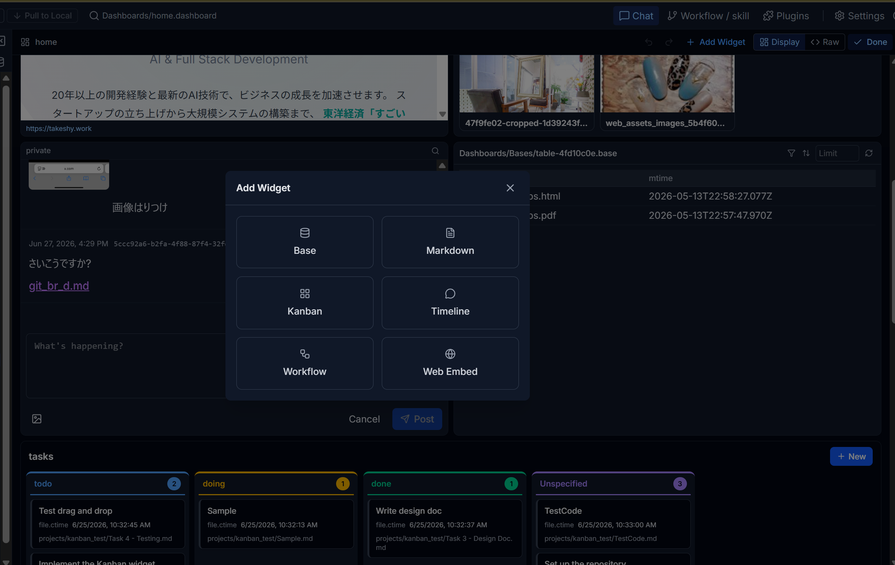

### ワークフローノード編集

フォームベースの UI でワークフローノードを編集。LLM プロンプト、モデル、Drive ファイル操作などを設定できます。

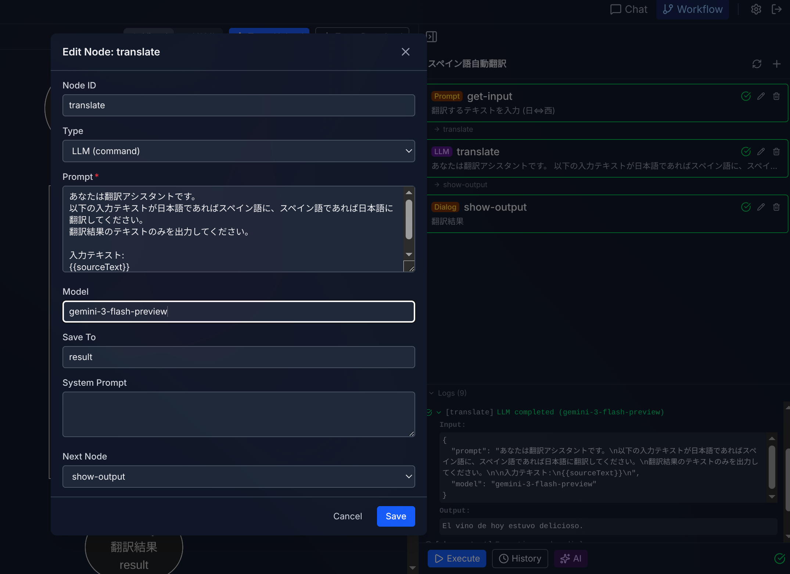

### ワークフロー実行

ワークフローを実行し、リアルタイムのストリーミング出力と実行ログを確認できます。


### AI ワークフロー生成

自然言語でワークフローを作成・修正。AI が YAML を生成し、ストリーミングプレビューと思考過程を表示します。

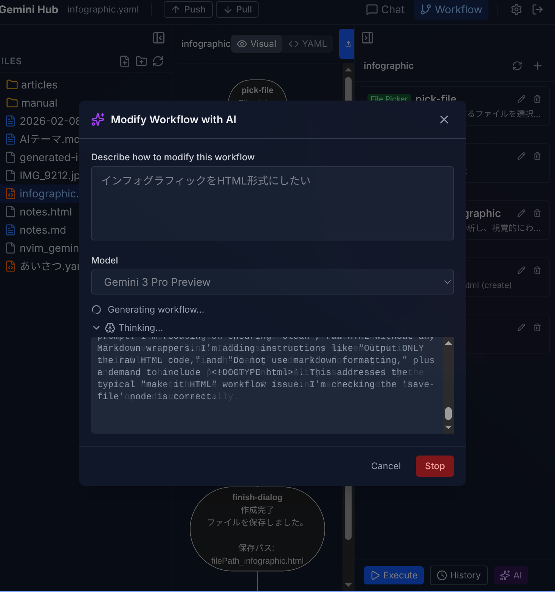

### ファイル管理

コンテキストメニューから Drive ファイルを管理 — Web 公開、履歴表示、暗号化、リネーム、ダウンロードなど。

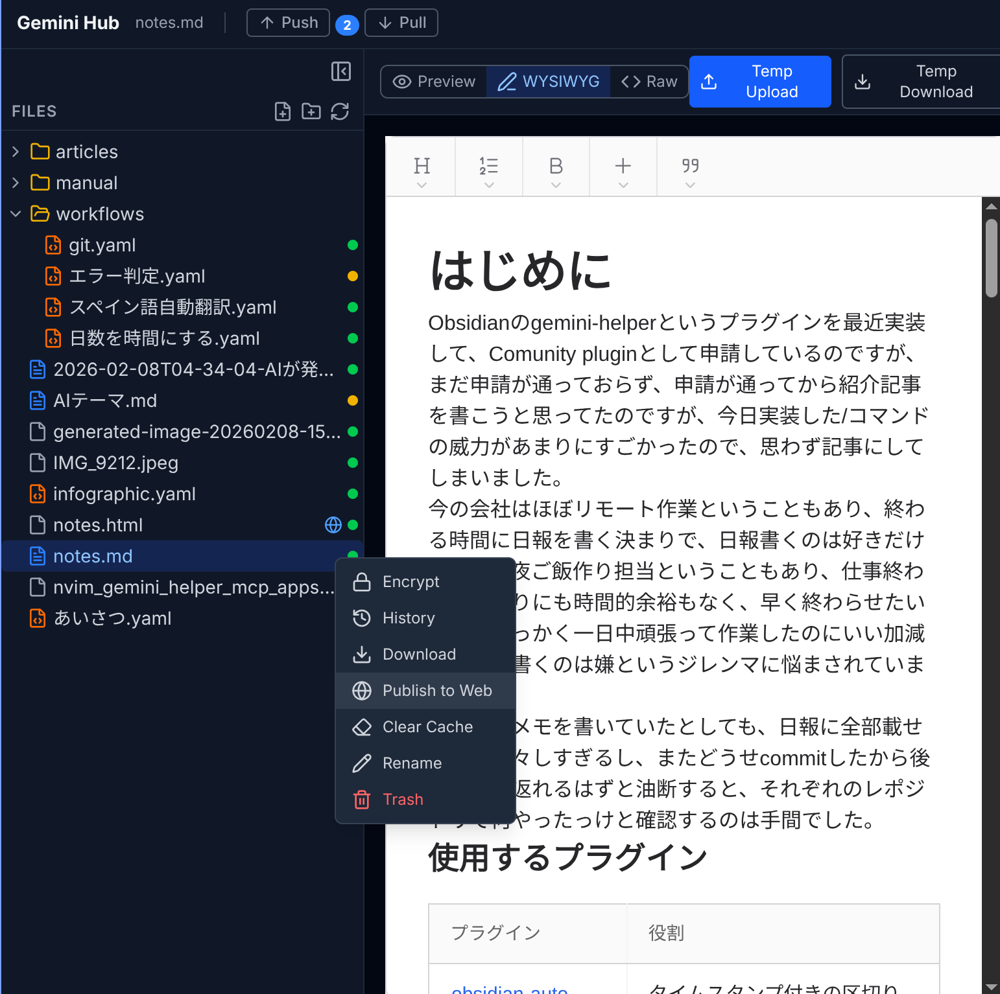

## 機能一覧

- **ドキュメントメモ** — Markdown・PDF・EPUB・テキスト・画像に対するドキュメント単位のメモタイムライン。IDE のビューアとダッシュボードの File ウィジェット両方で利用可能。テキスト選択 → 右クリック →「メモに追加」で引用アンカー付きハイライト（CSS Custom Highlight API）を作成し、ドキュメント⇄メモを双方向ジャンプ。ピン留め・編集・削除、WYSIWYG / 生 Markdown コンポーザー、wiki リンク対応。`Dashboards/Memos/` 配下のプレーン Markdown としてローカルファーストで保存し、Push で Drive に同期
- **PDF・EPUB ビューア** — テキスト選択・ページナビ・ズーム対応の pdf.js ベース PDF ビューアと、フォントサイズ・ページ幅を調整できるクライアントサイド EPUB リーダー。IDE とダッシュボード File ウィジェットの両方で利用可能
- **カスタマイズ可能なダッシュボード** — ホーム画面となるドラッグ＆ドロップのウィジェットグリッド。Drive ファイルを開く **File** ウィジェット（Markdown（プレビュー/WYSIWYG/コード）・テキスト・HTML・EPUB・PDF・画像、ドキュメントメモ付き）、メモを付けた全ドキュメントを一覧する **Memo List** ウィジェット（最新メモのプレビュー、絞り込み・ページング、元ファイルへジャンプ）、フォルダ内 Markdown ノートに対する Obsidian 風 `.base` クエリのビュー（テーブル／カード／リスト）を描画する **Base** ウィジェット（旧カード／テーブル／ファイル一覧はこの Base 形式で作成、既存レガシーは設定画面から変換可能）、`.kanban` ベースのボード（カード作成とモーダル内編集、表示項目設定、一時タグ絞り込み、未該当ステータス列の表示切替、ドラッグでのステータス変更を `.md` に書き戻し）、暗号化された **Secret Manager**、`#タグ`・wiki リンク・画像添付つき投稿、モデル選択つき AI 書き換え、ピン留め・編集・タグ／キーワード／日付フィルタ、折り畳み設定に対応し `Dashboards/Timeline/` 配下に保存される**タイムライン**マイクロブログ、ワークフローを実行して出力を描画するウィジェット（カード／テーブル／Markdown／HTML、任意で自動更新）、Web 埋め込みに対応。複数ダッシュボード、ホバーで現れるドラッグ／リサイズ／最大化／ファイルを開く／設定／削除操作、Undo/Redo、ワンクリック整列（列／行）、ホーム固定、レンダリング／生 YAML 表示切替
- **Secret Manager** — ダッシュボードウィジェットから RSA + AES で暗号化された値を作成・管理。`.encrypted` ファイルをフォルダで整理し、名前・説明・公開メタデータで検索、ロック解除してコピー、値をその場で編集可能。シークレット値は暗号化され、名前と検索可能なメタデータはロック解除前にも表示される
- **AI チャット** — Gemini とのストリーミング会話、Function Calling、思考表示、画像生成、ファイル添付
- **スラッシュコマンド** — ユーザー定義の `/コマンド`、テンプレート変数（`{content}`, `{selection}`（ファイルID・位置情報付き））、`@ファイル` メンション（Drive ファイルIDに解決しツール経由でアクセス）、コマンドごとのモデル/ツール設定。`/run @workflow.yaml` でチャットからワークフローを直接実行（インラインストリーミングログ付き）
- **ビジュアルワークフローエディタ** — ビジュアルノードベースビルダー（30種のノードタイプ）、YAML 入出力、SSE リアルタイム実行
- **AI ワークフロー生成** — 自然言語でワークフローを作成・修正、ストリーミングプレビューと差分表示
- **キーボードショートカット** — 修飾キー対応（Ctrl/Cmd, Shift, Alt）のカスタムショートカットを設定画面から設定可能
- **RAG** — Drive ファイルを Gemini File Search に同期し、コンテキストを考慮した AI 応答を実現
- **OKF ナレッジソース** — Drive 上の Markdown ナレッジベース（OKF バンドル）。設定の RAG タブで親フォルダを指定し、使用するバンドルはチャットごとにセレクタで選択
- **MCP** — 外部 MCP サーバーを AI チャットのツールとして接続
- **プラグイン** — GitHub からインストールまたはローカル開発。カスタムビュー、スラッシュコマンド、設定パネル、カスタムファイルアイコン、ファイル拡張子ハンドリングの API を提供
- **Google Drive 連携** — 全データを自分の Drive に保存、外部データベース不要
- **リッチ Markdown エディタ** — wysimark-lite による WYSIWYG ファイル編集
- **オフラインキャッシュ & 同期** — IndexedDB によるオフラインファースト。インターネットなしでファイルを編集し、Push/Pull で Drive と同期。コンフリクトの自動検出と解決（バックアップ付き）。一時UP/DL を使えば Pull で上書きされたくないファイルを保護可能 — Pull 前に一時UP、Pull 後に一時DL で復元。Obsidian など外部クライアント向けの外部同期トークン
- **暗号化** — 個別ファイル・チャット履歴・ワークフローログのハイブリッド RSA + AES 暗号化（オプション）
- **変更履歴** — unified diff 形式によるワークフロー・Drive ファイルの変更追跡
- **マルチモデル対応** — Gemini 3.1 Pro, Gemini 3, 2.5, Flash, Pro, Lite, Gemma。有料/無料プラン別モデルリスト
- **画像生成** — Gemini 画像モデルで画像を生成
- **多言語対応** — 英語・日本語 UI

## ドキュメント

詳細なドキュメントは [`docs/`](./docs/) ディレクトリに OKF（Open Knowledge Format）バンドルとして整理されています。全体の目次は [docs/index.md](./docs/index.md) を参照してください:

| トピック | ドキュメント |
|---------|------------|
| チャット & AI | [features/chat.md](./docs/features/chat.md) |
| ダッシュボード（ウィジェット・メモ） | [features/dashboard.md](./docs/features/dashboard.md) |
| エディタ | [features/editor.md](./docs/features/editor.md) |
| 検索 | [features/search.md](./docs/features/search.md) |
| 同期 & オフラインキャッシュ | [features/sync.md](./docs/features/sync.md) |
| 編集履歴 | [features/history.md](./docs/features/history.md) |
| MCP | [integrations/mcp.md](./docs/integrations/mcp.md) |
| プラグイン | [integrations/plugins.md](./docs/integrations/plugins.md) |
| RAG | [integrations/rag.md](./docs/integrations/rag.md) |
| Agent Skills | [integrations/skill.md](./docs/integrations/skill.md) |
| ワークフロー実行エンジン | [workflows/workflow_execution.md](./docs/workflows/workflow_execution.md) |
| ワークフローノードリファレンス | [workflows/workflow_nodes.md](./docs/workflows/workflow_nodes.md) |
| インフラストラクチャ | [architecture/infrastructure.md](./docs/architecture/infrastructure.md) |
| プレミアムプラン | [architecture/premium.md](./docs/architecture/premium.md) |
| 暗号化 | [architecture/encryption.md](./docs/architecture/encryption.md) |
| ユーティリティ（右クリックメニュー、ゴミ箱、コマンド） | [architecture/utils.md](./docs/architecture/utils.md) |
| OKF ナレッジソース | [references/OKF.md](./docs/references/OKF.md) |

ドキュメントは英語のみです。日本語で読みたい場合は、AI チャットに翻訳を依頼してください。

## はじめかた

### 前提条件

- Node.js 24 以上
- Google Cloud プロジェクト（下記手順で設定）
- Gemini API キー

### 1. Google Cloud の設定

[Google Cloud Console](https://console.cloud.google.com/) で以下を行います。

#### プロジェクト作成
1. 左上「プロジェクトを選択」→「新しいプロジェクト」→ 名前を付けて作成

#### Google Drive API を有効化
1. 「API とサービス」→「ライブラリ」
2. "Google Drive API" を検索して「有効にする」

#### OAuth 同意画面の設定
1. 「API とサービス」→「OAuth 同意画面」
2. User Type: **外部** を選択
3. アプリ名（例: GemiHub）、ユーザーサポートメール、デベロッパー連絡先を入力
4. スコープ追加: `https://www.googleapis.com/auth/drive.file`
5. テストユーザーに自分の Gmail アドレスを追加（公開前は自分しかアクセスできません）

> **重要: Google Drive のファイルアクセスについて**
>
> このアプリは `drive.file` スコープを使用しており、**アプリ自身が作成したファイルにのみアクセスできます**。Google Drive の Web UI や他のアプリから `gemihub/` フォルダに直接アップロードしたファイルは GemiHub からは**見えません**。ファイルを追加するには、アプリ内のアップロード機能を使用するか、AI チャット経由で作成してください。

#### OAuth 認証情報の作成
1. 「API とサービス」→「認証情報」→「＋認証情報を作成」→「OAuth クライアント ID」
2. アプリケーションの種類: **ウェブアプリケーション**
3. 名前: 任意（例: GemiHub Local）
4. **承認済みリダイレクト URI** に追加: `http://localhost:8132/auth/google/callback`
5. 作成後、**クライアント ID** と **クライアントシークレット** をメモ

### 2. Gemini API キーの取得

1. [Google AI Studio](https://aistudio.google.com/) にアクセス
2. 左メニュー「API キー」→「API キーを作成」
3. キーをメモ（あとでアプリの設定画面から入力します）

> **無料 API の制限:** Gemini API の無料枠はレート制限が厳しく、利用できるモデルも限られています。お試しには十分ですが、日常的な利用には不十分です。本格的に使うには有料プランが必要です。[Google AI Pro](https://one.google.com/about/ai-premium)（$19.99/月）がおすすめです。月 $10 の Google Cloud クレジットが付属し、Gemini API を十分にカバーできるほか、2 TB Google One ストレージや Gemini Code Assist なども含まれます。詳細は [Gemini API Pricing](https://ai.google.dev/pricing) を参照してください。

### 3. クローンとインストール

```bash
git clone <repository-url>
cd gemihub
npm install
```

### 4. 環境変数の設定

```bash
cp .env.example .env
```

`.env` を編集:

```env
GOOGLE_CLIENT_ID=your-client-id.apps.googleusercontent.com
GOOGLE_CLIENT_SECRET=GOCSPX-your-client-secret
GOOGLE_REDIRECT_URI=http://localhost:8132/auth/google/callback
SESSION_SECRET=<ランダム文字列>
# 任意: 非公開Cloud Storage上のGemiHub OKF配布先
GEMIHUB_OKF_BUCKET=<bucket-name>
GEMIHUB_OKF_PREFIX=gemihub-okf
```

`SESSION_SECRET` の生成:

```bash
openssl rand -hex 32
```

### 5. 開発サーバーを起動

```bash
npm run dev
```

### 6. 初回セットアップ

1. ブラウザで `http://localhost:8132` を開く
2. 「Sign in with Google」をクリック → Google アカウントで認証
3. 右上の歯車アイコン（Settings）をクリック
4. **General** タブで Gemini API Key を入力して Save

チャット、ワークフロー作成、ファイル編集が使えるようになります。

> **Note:** 開発サーバーのポートは `vite.config.ts` で `8132` に設定されています。変更する場合は、設定ファイルと `.env` のリダイレクト URI、Google Cloud Console の承認済みリダイレクト URI も合わせて更新してください。

## 本番環境

### ビルド

```bash
npm run build
npm run start
```

### Docker

```bash
docker build -t gemihub .
docker run -p 8080:8080 \
  -e GOOGLE_CLIENT_ID=... \
  -e GOOGLE_CLIENT_SECRET=... \
  -e GOOGLE_REDIRECT_URI=https://your-domain/auth/google/callback \
  -e SESSION_SECRET=... \
  gemihub
```

## プレミアムプラン

有料プラン（Stripe 経由 ¥2,000/月）では、GemiHub に **Web アプリビルダー** 機能が追加されます。単一の共有 Cloud Run インスタンスが全有料アカウントを処理し、各アカウントはビルトインサブドメイン（`{slug}.gemihub.net`）とオプションのカスタムドメインを持ちます。アカウントデータは Firestore に保存、ページは Drive から CDN 経由で直接配信、スケジュールワークフローは自動実行されます。詳細は [docs/architecture/premium.md](docs/architecture/premium.md) を参照。

### 有料限定機能

| 機能 | 説明 |
|------|------|
| **Stripe サブスクリプション** | ¥2,000/月、webhook 駆動のアカウントプロビジョニングとライフサイクル管理 |
| **管理画面** | `/hubwork/admin` でアカウント管理（Basic 認証 + Google OAuth メール制限） |
| **Google Sheets CRUD** | ワークフローノード: `sheet-read`, `sheet-write`, `sheet-update`, `sheet-delete` |
| **Gmail 送信** | ワークフローノード: `gmail-send`。Gmail API 経由でメール送信 |
| **ファイルベースページホスティング** | Drive の `web/` にファイルを配置 — Drive API + CDN 経由で直接配信、`[param]` 動的ルート対応 |
| **ビルトインサブドメイン** | アカウント作成時に `{slug}.gemihub.net` が即座に利用可能 |
| **カスタムドメイン** | オプションでアカウントごとに独自ドメイン。Certificate Manager で SSL 自動発行 |
| **コンタクト認証** | Gmail 経由のマジックリンクログイン。セッション Cookie で AJAX データアクセス |
| **currentUser API** | Sheets からフィールドフィルタ済みユーザーデータを `GET /hubwork/api/me` で取得 |
| **フォーム→ワークフロー** | HTML フォーム送信で `POST /hubwork/actions/{workflowId}` 経由の実行（冪等性・ハニーポット対応） |
| **サーバサイド実行** | `script` を含む全ノードタイプをサーバサイドで実行（`isolated-vm` 使用） |
| **定期ワークフロー実行** | Cloud Scheduler + Firestore による cron ベースのマルチテナント実行（リトライ遅延対応） |

### アーキテクチャ概要

```
Load Balancer + Cloud CDN + Certificate Manager
  ├── *.gemihub.net     → Cloud Run（ワイルドカードサブドメイン）
  ├── app.acme.com         → Cloud Run（カスタムドメイン）
  └── app.other.com        → Cloud Run（同じバックエンド）

Cloud Run（単一インスタンス、マルチテナント）
  ├── GemiHub IDE（無料機能）
  ├── Hubwork API（Host ヘッダーでアカウント解決）
  ├── ページプロキシ（ファイルベースルーティング、Drive → CDN キャッシュ）
  ├── スケジュールワークフロー実行
  └── isolated-vm（サーバサイド script 実行）

Firestore
  ├── アカウント + トークン
  ├── scheduleIndex + runtime
  ├── フォーム送信（TTL）
  └── マジックリンクトークン（TTL）
```

### ワークフローノード（有料限定）

| ノード | 説明 |
|--------|------|
| `sheet-read` | フィルタ・件数制限付きで行を読み取り |
| `sheet-write` | シートに行を追加 |
| `sheet-update` | フィルタに一致する行を更新 |
| `sheet-delete` | フィルタに一致する行を削除 |
| `gmail-send` | Gmail API でメール送信 |

### セットアップ

1. **設定 > Hubwork** タブでサブスクリプション登録（¥2,000/月）— サブドメイン slug を選択
2. サブスクリプション完了後、Hubwork 機能が自動有効化
3. Sheets 連携を設定（スプレッドシート ID、ユーザーシート、接続シート）
4. オプションでカスタムドメインを設定 — DNS レコードと SSL 証明書は自動プロビジョニング
5. `web/` に HTML/CSS/JS/画像ファイルを配置して Push で公開

## アーキテクチャ

| レイヤー | 技術 |
|---------|------|
| フロントエンド | React 19, React Router 7, Tailwind CSS v4, Mermaid |
| バックエンド | React Router サーバー（SSR + API ルート） |
| AI | Google Gemini API (`@google/genai`) |
| ストレージ | Google Drive API, Firestore |
| 認証 | Google OAuth 2.0 → セッション Cookie |
| インフラ | Cloud Run, Cloud Build, Artifact Registry, Cloud DNS, Certificate Manager, Cloud Scheduler, Global HTTPS LB + CDN |
| エディタ | wysimark-lite（Slate ベース WYSIWYG） |

## 謝辞

GemiHub に組み込まれている Markdown、Base、Canvas の Agent Skill は、当初 [kepano/obsidian-skills](https://github.com/kepano/obsidian-skills) を参考にしました。対応するファイル形式の機能は、公開されている仕様と振る舞いをもとに独自実装したものであり、Obsidian のソースコードは使用していません。Base は独立して標準化されたオープン形式ではなく互換形式として説明し、Canvas はオープンな [JSON Canvas 仕様](https://jsoncanvas.org/)に準拠しています。

WYSIWYG Markdown エディターには、[portive/wysimark](https://github.com/portive/wysimark) を軽量化したフォークである [takeshy/wysimark-lite](https://github.com/takeshy/wysimark-lite) を使用しています。Steph Ango（@kepano）氏、Wysimark の作者とコントリビューター、JSON Canvas のメンテナーの皆様に、心より敬意と感謝を表します。詳細は[第三者ライセンス通知](THIRD_PARTY_NOTICES.md)をご覧ください。

GemiHub は独立したプロジェクトであり、Obsidian との提携、Obsidian による承認または後援を受けたものではありません。

## ライセンス

MIT
