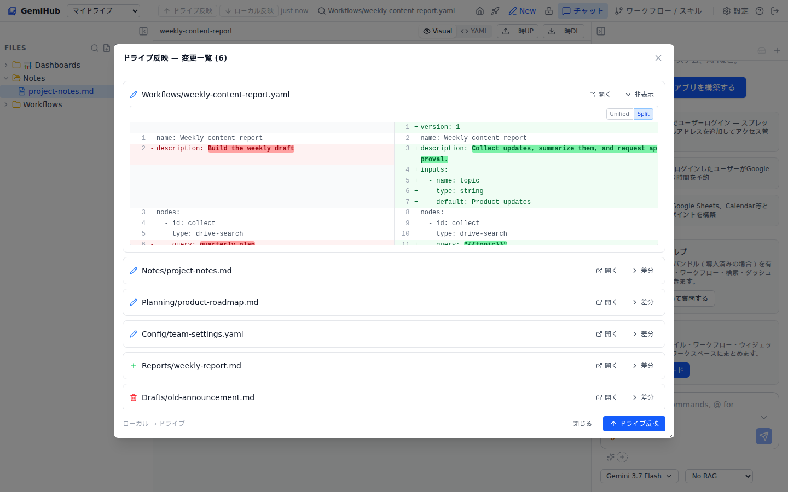
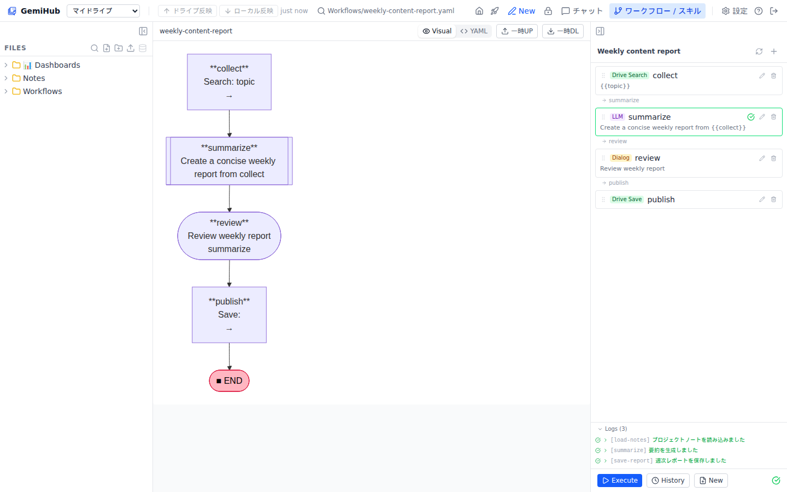

# GemiHub

**ドキュメントを読み、線を引き、そのまま Gemini に聞く — すべてあなた自身の Google Drive の中で。**

Drive の PDF・EPUB・Markdown を開き、気になった一節をハイライトして、その場にメモを貼る。ハイライトもメモも、ダッシュボードもチャット履歴もワークフローも、すべて *あなたの* Drive にある普通のファイルです。だから AI はそのすべてを読めるし、あなたはいつでも全部を持って出ていけます。外部データベースなし。セルフホスト可能。

**[gemihub.net で今すぐ試す →](https://gemihub.net)** · [English README](./README.md)


## GemiHub でできること

### 読んだドキュメントと、そこに書いたメモを一体に

PDF・EPUB・Markdown・テキスト・画像を、メインビューアでもダッシュボードの **File ウィジェット**でも開き、文章を選択して右クリック →「メモに追加」。ドキュメントごとに専用のメモタイムラインが付きます。

- **引用アンカー付きハイライト** — 選択した引用が前後の文脈とともに記録され、CSS Custom Highlight API で本文上にハイライト表示されます。アンカーは引用文字列が主体なので、ドキュメントの編集や EPUB のリフローでも失われません。
- **双方向ジャンプ** — ハイライトをクリックするとメモへ、メモ内の引用をクリックすると本文の該当箇所へジャンプします。
- **本格的なタイムライン** — WYSIWYG / 生 Markdown 両対応のコンポーザー、ピン留め・編集・削除、IDE で開ける wiki リンク。パネルは細いレールに折り畳めるので、ハイライトを表示したまま読み進められます。
- **プレーンな Markdown 保存** — メモは Drive の `Dashboards/Memos/` 配下にある普通の Markdown ファイル。ポータブルで検索も同期も自由 — ただのファイルなので、チャットや RAG からも参照できます。

組み込みの pdf.js ビューア（テキスト選択・ページナビ・ズーム）とクライアントサイド EPUB リーダー（フォントサイズ・ページ幅調整）により、メモを付けたいドキュメントをそのまま快適に読めます。


### 自分のファイルで組み立てるダッシュボード

ホーム画面はドラッグ＆ドロップのウィジェットグリッドです。メモ付きのファイルビューア、メモ一覧、フォルダ内 Markdown への Obsidian 風 **Base** クエリ、ステータス変更を元の Markdown に書き戻すカンバン、タイムラインマイクロブログ、暗号化された Secret Manager、ワークフローの実行結果、Web 埋め込みを自由に配置できます。ダッシュボードは複数作成でき、ひとつをホームに固定可能。それぞれ Drive 上の `.dashboard` ファイルとして保存され、レンダリング表示と生 YAML を切り替えて編集できます。


### 最初から文脈を持っている AI

Gemini とのストリーミングチャットは、ファンクションコール・思考プロセス表示・画像生成に対応し、あなたのファイルを直接読み・検索し・作成し・更新します。**RAG** による意味検索、Markdown ナレッジベースを束ねた **OKF バンドル**、**MCP** による外部ツール接続、再利用可能な **Agent Skills** を組み合わせ、ブラウザ上で実行され結果をリアルタイムに流す**ビジュアルワークフロー**で自動化まで繋げられます。


### あなたのデータは、あなたの管理下に

チャット履歴・ワークフロー・設定・編集履歴は、すべてあなた自身の Google Drive の `gemihub/` フォルダに保存されます。独自データベースもベンダーロックインもありません。任意でハイブリッド RSA + AES 暗号化を有効にでき、単体で動く Python 復号スクリプトも同梱しているので、GemiHub なしでも自分のデータを読めます。

GemiHub はオフラインファーストです。ファイルは IndexedDB にキャッシュされて即座に開き、ネットがなくても編集でき、同期は Push/Pull で自分のタイミングで行えます。MD5 による競合検出、差分表示付きの解決ダイアログ、選ばなかった方の自動バックアップ付き。同じ `_sync-meta.json` 形式を [Obsidian プラグイン](https://github.com/takeshy/obsidian-gemihub)も扱うため、Vault と GemiHub で同じ Drive フォルダを共有できます。



## 機能一覧

**読書とメモ** — Markdown・PDF・EPUB・テキスト・画像に対するドキュメント単位のメモタイムライン、引用アンカー付き双方向ハイライト、プレーン Markdown 保存 · pdf.js PDF ビューア · クライアントサイド EPUB リーダー · メモを付けた全ドキュメントを俯瞰する Memo List ウィジェット

**ダッシュボード** — Undo/Redo・ワンクリック整列・複数ダッシュボード・ホーム固定に対応したドラッグ＆ドロップグリッド · File / Memo List / Base（`.base` クエリをテーブル・カード・リストで表示）/ Kanban（`.kanban` YAML、ドラッグでのステータス変更を Markdown に書き戻し）/ Secret Manager / Timeline / ワークフロー出力（自動更新可）/ Web ウィジェット

**AI チャット** — ファンクションコール・思考表示・画像生成・ファイル添付に対応したストリーミングチャット · `{content}` / `{selection}` / `@file` テンプレートとコマンド別のモデル・ツール上書きを持つスラッシュコマンド · チャットからの `/run @workflow.yaml`

**ナレッジ** — Drive ファイルへの RAG 意味検索 · チャットごとに選べる OKF ナレッジバンドル · MCP サーバーのツール化（OAuth 対応、インタラクティブな MCP Apps）· Agent Skills（カタログからワンクリック導入できる外部スキルを含む）· GitHub からインストール、あるいはローカル開発できるプラグイン

**編集** — WYSIWYG Markdown エディタ（wysimark-lite）· Obsidian 互換 JSON Canvas · ファイルとワークフローの差分ベース編集履歴 · ドキュメントの公開 URL 発行 · ファイル・チャット履歴・ワークフローログの暗号化

**自動化** — ブラウザ上で動く 25 種のノード（有料プランでは Gmail・Google カレンダー・Sheets ノードを追加）、YAML インポート/エクスポート、SSE によるリアルタイム実行を備えたビジュアルワークフローエディタ · 自然言語からのワークフロー生成（ストリーミング差分プレビュー付き）

**チーム** — Cloud Storage と Vertex AI 上の組織プロジェクト。メンバーロール、メンバー別 AI 予算、プロジェクト単位のダッシュボードとワークフロー

**その他** — カスタマイズ可能なキーボードショートカット · アプリ内で最新に保たれる Gemini / Gemma モデル選択 · 暗号化シークレット管理 · 復元可能なゴミ箱 · 日本語 / 英語 UI

<details>
<summary>スクリーンショットをもっと見る</summary>

**ダッシュボードのウィジェット** — カンバン、ワークフロー出力、タイムライン、Base ビュー設定、編集操作。


**Secret Manager** — RSA + AES で暗号化した値を、Drive フォルダ内の自己完結した `.encrypted` ファイルとして管理。復号前でも名前や可視メタデータで検索できます。


**ナレッジとスキル** — チャットでの OKF バンドル利用、AI によるバンドル作成、ワンクリック導入の外部スキル。


**ワークフロー** — ノード編集、実行ログ、AI 生成。





**組織** — 共有プロジェクト、メンバー管理、プロジェクトダッシュボード。


**ファイル** — 公開・履歴・暗号化・ダウンロードを備えた右クリックメニュー、Canvas 編集。


</details>

## はじめかた

いちばん手軽なのはホスティング版です。**[gemihub.net](https://gemihub.net)** に Google でサインインし、設定画面で Gemini API キーを入力するだけです。

自分で動かす場合:

```bash
git clone <repository-url>
cd gemihub
npm install
cp .env.example .env   # OAuth 認証情報と SESSION_SECRET を記入
npm run dev            # http://localhost:8132
```

必要なものは Node.js 24+、Google Cloud の OAuth クライアント、Gemini API キーです。Cloud プロジェクトの作成、OAuth 同意画面、`drive.file` スコープの意味、環境変数、Docker / 本番ビルドまでの詳細な手順は **[docs/architecture/self-hosting.md](./docs/architecture/self-hosting.md)** にまとめてあります。

## プラン

GemiHub は MIT ライセンスで、自分の Gemini API キーがあれば無料ですべての基本機能を使えます。ホスティング版には有料プランが 3 つあります（詳細は [docs/architecture/premium.md](docs/architecture/premium.md)）。

| | 無料 | Premium — 月額 ¥300（約 $2） | Pro — 月額 ¥3,000（約 $20） | Business — 月額 ¥7,500（約 $50）／組織単位 |
|---|---|---|---|---|
| 上記の全機能 | ✓ | ✓ | ✓ | ✓ |
| アップロード上限 | 1ファイル20 MB | 1ファイル5 GB | 1ファイル5 GB | 1ファイル5 GB |
| Gmail 送信・Google カレンダーのワークフローノード | — | ✓ | ✓ | ✓ |
| PDF 生成・外部同期トークン・一時編集 URL | — | ✓ | ✓ | ✓ |
| Interactions API チャット（ファンクションツール + RAG + Web 検索の同時利用） | — | ✓ | ✓ | ✓ |
| スケジュール実行 + `web/` からのページ配信（`{slug}.gemihub.net`） | — | — | ✓（自分のDriveから配信） | ✓（CDN・カスタムドメイン・ワークフローAPIも） |
| Google Sheets ワークフローノード | — | — | — | ✓ |
| Cloud Storage + Vertex AI の共有組織 | — | — | — | 100 GB・月 $30 の AI 利用枠込み |

Gemini API キーを自分で用意したくない場合は、設定で**パーソナル Vertex AI** を有効にすると、GemiHub の Vertex 接続でチャットが動きます。料金は $10（¥1,500）単位で前払いする残高から消費され、有効期限はなく、どのプランでも利用できます。Business の月 $30 の AI 利用枠も同じ方法で追加購入できます。

Business は「すべてがあなたの Drive に残る」唯一の例外です。共有プロジェクトのファイルはマネージドな Cloud Storage に、メタデータは Firestore に置かれ、チャットは Vertex AI 上で動きます。個人のマイドライブ側は従来どおりです（[docs/architecture/mounts.md](docs/architecture/mounts.md)）。

## ドキュメント

ドキュメントは [`docs/`](./docs/) に OKF バンドルとして整理されています（目次は [docs/index.md](./docs/index.md)）。英語版のみです。

| トピック | ドキュメント |
|---------|-------------|
| チャット & AI | [features/chat.md](./docs/features/chat.md) |
| ダッシュボード（ウィジェット・メモ） | [features/dashboard.md](./docs/features/dashboard.md) |
| エディタ | [features/editor.md](./docs/features/editor.md) |
| 検索 | [features/search.md](./docs/features/search.md) |
| 同期 & オフラインキャッシュ | [features/sync.md](./docs/features/sync.md) |
| 編集履歴 | [features/history.md](./docs/features/history.md) |
| MCP | [integrations/mcp.md](./docs/integrations/mcp.md) |
| プラグイン | [integrations/plugins.md](./docs/integrations/plugins.md) |
| RAG | [integrations/rag.md](./docs/integrations/rag.md) |
| Agent Skills | [integrations/skill.md](./docs/integrations/skill.md) |
| OKF ナレッジソース | [references/OKF.md](./docs/references/OKF.md) |
| ワークフロー実行エンジン | [workflows/workflow_execution.md](./docs/workflows/workflow_execution.md) |
| ワークフローノードリファレンス | [workflows/workflow_nodes.md](./docs/workflows/workflow_nodes.md) |
| セルフホスト | [architecture/self-hosting.md](./docs/architecture/self-hosting.md) |
| ストレージマウントと AI プロバイダ | [architecture/mounts.md](./docs/architecture/mounts.md) |
| インフラ | [architecture/infrastructure.md](./docs/architecture/infrastructure.md) |
| 有料プラン | [architecture/premium.md](./docs/architecture/premium.md) |
| 暗号化 | [architecture/encryption.md](./docs/architecture/encryption.md) |
| ユーティリティ（右クリックメニュー・ゴミ箱・コマンド） | [architecture/utils.md](./docs/architecture/utils.md) |

## アーキテクチャ

| レイヤー | 技術 |
|---------|------|
| フロントエンド | React 19, React Router 7, Tailwind CSS v4, Mermaid |
| バックエンド | React Router サーバー（SSR + API ルート） |
| AI | Google Gemini API（`@google/genai`）、組織プロジェクトは Vertex AI |
| ストレージ | Google Drive API（デフォルトマウント）、Cloud Storage（組織プロジェクト）、Firestore |
| 認証 | Google OAuth 2.0 → セッションクッキー |
| インフラ | Cloud Run, Cloud Build, Artifact Registry, Cloud DNS, Certificate Manager, Cloud Scheduler, Global HTTPS LB + CDN |
| エディタ | wysimark-lite（Slate ベース WYSIWYG） |

## 謝辞

GemiHub 組み込みの Markdown / Base / Canvas Agent Skills は、[kepano/obsidian-skills](https://github.com/kepano/obsidian-skills) を参考に作成を始めました。対応するファイル形式のサポートは、公開されている形式・挙動の説明をもとに独自に実装したもので、Obsidian のソースコードは含んでいません。Base は独立した標準仕様ではなく互換フォーマットとして扱っています。Canvas はオープン仕様である [JSON Canvas](https://jsoncanvas.org/) に準拠しています。

WYSIWYG Markdown エディタには [takeshy/wysimark-lite](https://github.com/takeshy/wysimark-lite)（[portive/wysimark](https://github.com/portive/wysimark) の軽量フォーク）を使用しています。Steph Ango 氏（@kepano）、Wysimark の作者・コントリビューター、JSON Canvas のメンテナの皆さまに感謝します。著作権とライセンスの詳細は [Third-Party Notices](THIRD_PARTY_NOTICES.md) を参照してください。

GemiHub は独立したプロジェクトであり、Obsidian と提携・承認・後援関係にはありません。

## ライセンス

MIT


## MCP の承認と read-only ツール

MCP ツールは初期状態では実行ごとに承認が必要です。承認画面でサーバー名・ツール名・実行引数を確認し、「今回だけ許可」「このツールを常に許可」「拒否」を選べます。画面を閉じた場合も拒否になります。サーバー設定の「常に承認」は初期状態ではオフです。オンにするとそのサーバーの全ツールを承認なしで実行できます。個別に許可したツールは設定の許可リストから削除できます。ワークフローの `command` / `mcp` ノードで `confirm: "false"` を指定すると、自動実行を含め、そのノードの MCP 承認を省略します。その後の MCP App 操作には通常のサーバー設定が適用されます。read-only モードでは組み込みの読み取り・一覧・検索のみが使え、タイムライン追記を含む書き込みは禁止されます。外部 MCP やスキル内のワークフローはそれぞれの権限設定に従います。接続テスト中は編集操作が無効になり、失敗時のエラーを確認して修正できます。
