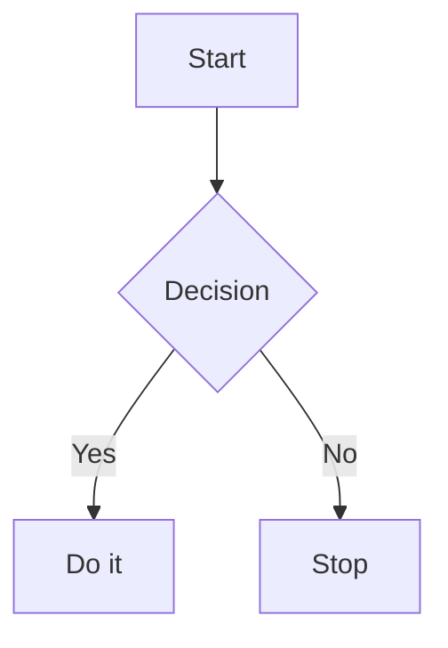

# GemiHub Markdown Skill

Create and edit Markdown files for GemiHub. Use this skill when working with `.md` or `.markdown` files, notes, frontmatter, callouts, Mermaid diagrams, tables, task lists, or Markdown preview behavior.

GemiHub supports standard Markdown and GitHub Flavored Markdown. Keep files portable and readable as plain text.

## Editing Rules

1. Preserve existing frontmatter unless the user asks to change it.
2. Use normal Markdown links (`[label](url)`) for external links.
3. Use relative file paths for links to files in the workspace when the target path is known.
4. Use fenced code blocks with language identifiers.
5. Prefer simple, stable Markdown over HTML.
6. Keep generated tables valid GFM tables.

## Frontmatter

GemiHub recognizes YAML frontmatter at the top of a Markdown file.

```yaml
---
title: Project Note
date: 2026-06-18
tags:
  - project
  - active
---
```

Common property types:

| Type | Example |
|------|---------|
| Text | `title: Project Note` |
| Number | `priority: 2` |
| Checkbox | `done: false` |
| Date | `date: 2026-06-18` |
| Date and time | `due: 2026-06-18T14:30:00` |
| List | `tags: [project, active]` or YAML list |

## Callouts

Use callouts for highlighted blocks in reading and preview mode.

```markdown
> [!note]
> Basic callout.

> [!warning] Custom Title
> Callout with a custom title.

> [!question]- Collapsed by default
> Foldable callout. Use `-` for closed and `+` for open.
```

Supported types: `note`, `abstract`, `info`, `todo`, `tip`, `success`, `question`, `warning`, `failure`, `danger`, `bug`, `example`, `quote`.

Aliases:

| Alias | Type |
|-------|------|
| `summary`, `tldr` | `abstract` |
| `hint`, `important` | `tip` |
| `check`, `done` | `success` |
| `help`, `faq` | `question` |
| `caution`, `attention` | `warning` |
| `fail`, `missing` | `failure` |
| `error` | `danger` |
| `cite` | `quote` |

## Mermaid Diagrams

GemiHub preview renders fenced Mermaid blocks.



Keep diagrams small enough to inspect in preview. For workflows, prefer `flowchart TD` unless another Mermaid diagram type is clearly better.

## Tables

Use valid GFM table syntax.

```markdown
| Item | Owner | Status |
|------|-------|--------|
| Spec | Aki | Draft |
| Review | Mina | Pending |
```

## Task Lists

```markdown
- [ ] Draft outline
- [x] Confirm requirements
- [ ] Publish update
```

## Images

Use standard Markdown image syntax.

```markdown

```

When adding images, use meaningful alt text and a workspace-relative path when possible.
