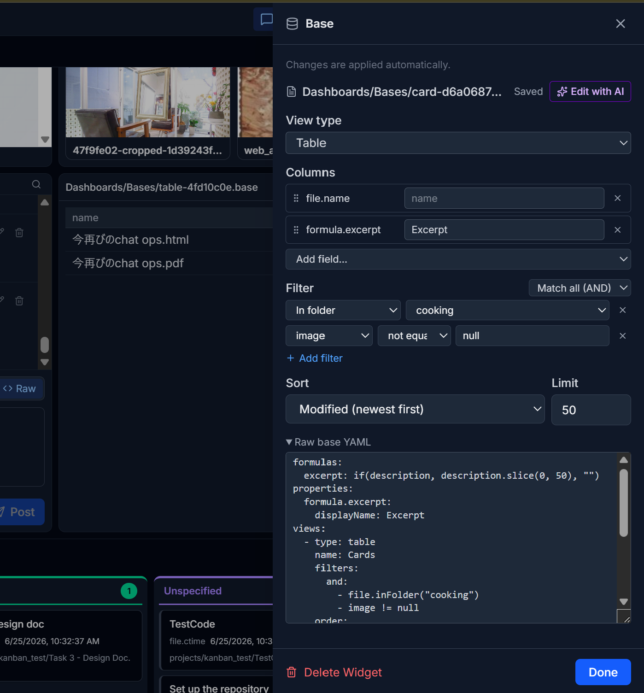
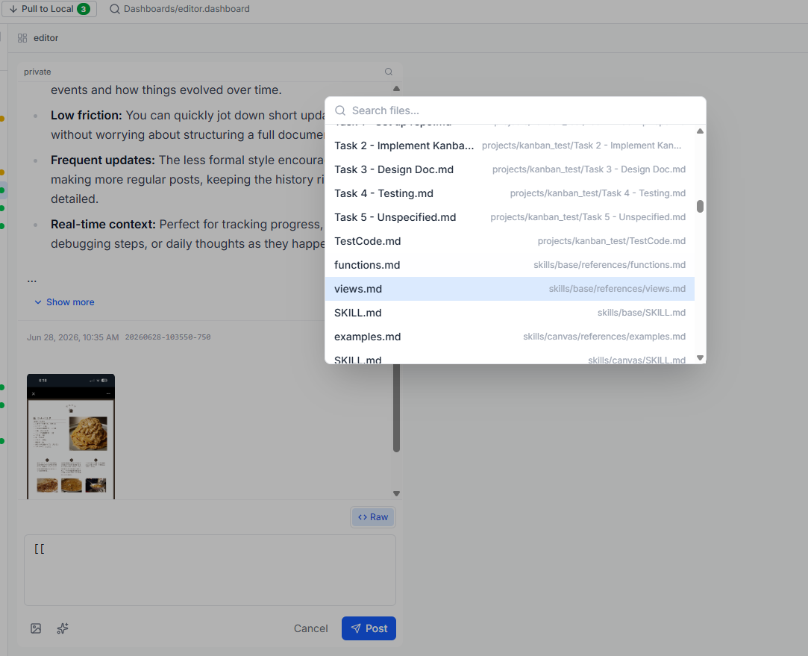
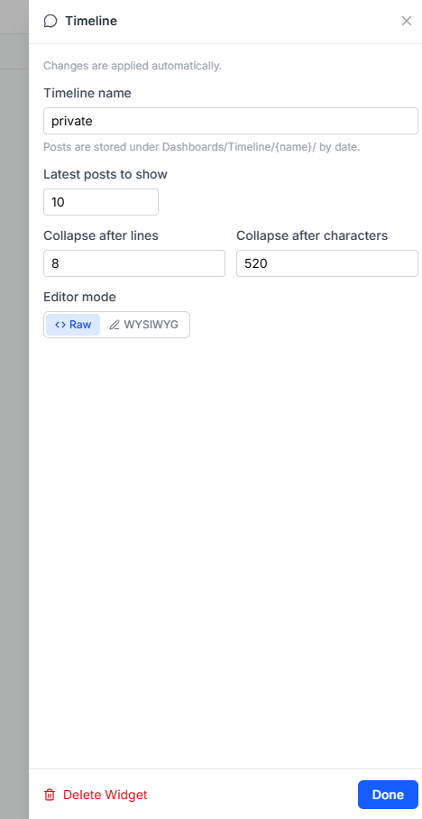
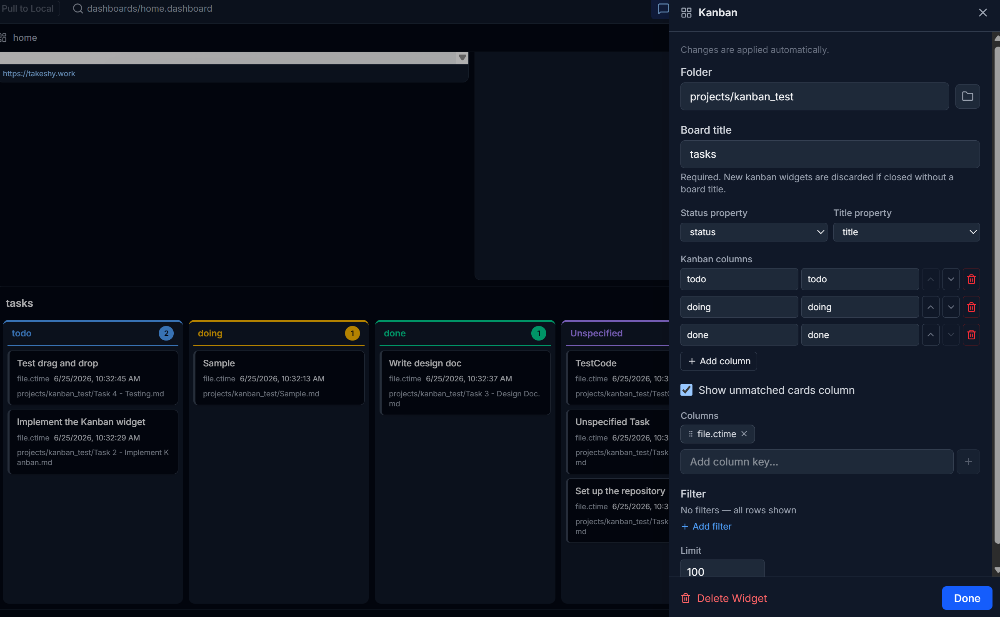

# Dashboard

The dashboard is a grid of configurable **widgets** rendered on the IDE home view. It is authored visually (drag/resize/configure directly on the grid, no separate edit mode) and persisted as a `.dashboard` YAML file in the user's Drive. Everything is local-first: edits update the IndexedDB cache and are reflected to Drive via the normal Push flow.

> Implementation lives under `app/dashboard/`.

## File format & storage

- A dashboard is a YAML file with the `.dashboard` extension.
- New dashboards are **always** created under `Dashboards/` (`Dashboards/{name}.dashboard`, the starter from the empty state is `Dashboards/home.dashboard`) — mirroring how workflows live under `workflows/`.
- Workflow result data is stored at `Dashboards/Data/<dashboardFileId>.json` as a **normal synced file** — it pushes/pulls and appears in the file tree and the push/pull diff like any other file (so a device that never ran the workflow still gets the output via Pull). It is regenerable last-write-wins data; the widget also lazy-fetches the latest copy on load (`loadCacheFile`).
- Trashed/history copies (`trash/…`, `history/…`) are excluded from the dashboard listing.

The schema (version 1):

```yaml
version: 1
grid:
  cols: 12
  rowHeight: 80
  gap: 8
widgets:
  - id: <uuid>
    type: file | base | kanban | timeline | workflow | web | memo-list
    layout:
      lg: { x: 0, y: 0, w: 6, h: 3 }
      sm: { x: 0, y: 0, w: 12, h: 3 }   # auto-derived if omitted
    config: { ... }                      # per-widget-type config (see below)
```

Unknown top-level keys and unknown widget config keys are **preserved on round-trip** (plugin widgets, future extensions). Unknown widget *types* fall back to `UnknownWidget`, which keeps their config intact so they can be deleted or saved back losslessly.

Key files: `dashboardFile.ts` (parse/serialize/load/save/list/rename/delete), `types.ts` (schema types).

## Layout & grid

- Two breakpoints: `lg` (wide) and `sm` (narrow, threshold `BREAKPOINT_THRESHOLD = 768px`). Missing `sm` layouts are auto-derived (full width, stacked) by `deriveSmLayout`.
- **No separate edit mode.** Hovering a widget cell reveals a chrome pill centered at the top (pill mover / Maximize / Open / Settings / drag grip / Delete) and a resize handle in the bottom-right corner — no mode toggle needed. The **Open** button appears only for file-backed widgets — those whose `WidgetDef.filePathOf(config)` resolves to an existing Drive file (file/markdown via `path`, workflow via `workflow`, base via `base`, kanban via `kanban`) — and navigates to that file's page in the main viewer (`plugin-select-file`). The chrome ignores pointer events until revealed, and it floats over the top **center** because widget headers keep their own controls (filter/sort icons, memo toggle) at the left/right edges. When the pill still covers a control, its small left nub drags the pill anywhere inside the cell (session-only; the offset resets on cell resize/maximize). On touch devices (`pointer: coarse`) the chrome is always visible and interactive, since hover-reveal is unreliable there. Undo/redo supports config-edit coalescing.
- **Maximize** — the pill's Maximize button expands one widget to fill the grid area (`absolute inset-0` overlay, ported from obsidian-gemini-helper); sibling cells stay mounted but hidden so their state survives restore. The state is ephemeral (not persisted) and clears automatically if the widget disappears (delete/undo/dashboard switch). Drag/resize handles are hidden while maximized.
- **Align (整列)** — two toolbar buttons tile all widgets evenly into up to 3 **columns** (horizontal) or 3 **rows** (vertical), round-robin, sized to roughly one screen (`equalizeLayout.ts`, ported from mdwys). One click is one undo step; `sm` layouts are dropped so `deriveSmLayout` re-derives the stacked layout.
- The canvas (`DashboardCanvas.tsx`) renders the grid; each widget lives in a `GridCell.tsx` that owns drag/resize. `DashboardHost.tsx` owns the dashboard lifecycle (create / rename / delete / switch, home pinning via `settings.homeDashboard`) and debounced save.

Adding a widget opens the `WidgetPalette` modal, which lists every registered widget type.

## Widget types

Widgets are registered in `widgets/registry.ts` via `registerWidget(def)`. Each `WidgetDef` supplies a `type`, palette `label`/`icon`, `defaultConfig`, `defaultSize`, a `render(config, ctx)` function, and an optional `ConfigEditor`.

| Type | Purpose | Source |
|------|---------|--------|
| `file` | Open a Drive file — Markdown (preview/wysiwyg/code), text, HTML, EPUB, PDF, image — with per-document memos | Drive file |
| `base` | Render a view (table/cards/list) of an Obsidian-style `.base` query file | `.base` + folder |
| `kanban` | Kanban board over a folder of markdown files | `.kanban` definition file + folder |
| `timeline` | Personal microblog of dated posts (tags, image attachments, pin/edit) | timeline folder |
| `workflow` | Run a workflow and render its output | workflow |
| `web` | Embed an external URL (with embeddability check + fallback card) | URL |
| `memo-list` | Browse all memo files (filter, paging, newest-memo preview) | `Dashboards/Memos/` |

The current core widget set is registered in `widgets/registry.ts`: `file`, `base`, `kanban`, `timeline`, `workflow`, `web`, `memo-list`. `web` is unchanged from the initial dashboard release; the others are described below.

> **Markdown widget is now the File widget.** The earlier `markdown` widget grew into `file` (same config shape, more formats + memos). Released dashboards persisting `type: markdown` keep working without migration: the registry registers the same `WidgetDef` under both types (`markdown` is hidden from the palette), so the YAML round-trips byte-stable. New widgets are written as `type: file`.

> **Folder data widgets are now Bases.** The earlier `card`, `table`, and `file-list` widgets (folder-source card grid / editable table / file list) have been **folded into the `base` widget** — they are now authored as `.base` files (a cards/table/list view over a folder). These three types are no longer registered; when a `.dashboard` still references one, its widget settings panel offers a one-click **Convert** that rewrites it to an equivalent `base` widget (`legacyFolderWidgetConversion.ts`), writing a generated `.base` under `Dashboards/Bases/`. The shared folder-source pipeline (`data-widget/`: `folder-source.ts`, `filter.ts`, `ViewControls.tsx`, `config-parts/`) lives on and is reused by the `base` widget for filtering/sorting and the view-time header controls.

### File widget

Opens an **existing** Drive file by path (no inline content) and renders it by kind (`docKindFor`, extension-based). Implemented under `widgets/file-widget/` (ported from mdwys).

```yaml
config:
  path: books/go_book.pdf   # Drive path — .md/.markdown, .txt, .html/.htm, .epub, .pdf, or an image
  showHeader: true          # header bar (memo toggle, file path, scale steppers)
  showProperties: true      # frontmatter properties panel (markdown only)
  viewFontScale: 100        # 70–240: PDF zoom / EPUB & HTML font size (%)
  viewWidthScale: 100       # 70–180: EPUB & HTML content width (%)
  memoPanelOpen: false      # memo timeline panel state (persisted like the rest)
  memoPanelCollapsed: false
```

Per kind:

- **Markdown** — the normal markdown editor inline via `MarkdownFileEditor` — the same **preview / wysiwyg / code** toggle, frontmatter, and wiki links as the main editor, with local-first saving (`useFileWithCache`). The view mode defaults to **preview** on the first view of a session, then a session-scoped variable remembers the user's last explicit toggle across file switches.
- **PDF** — pdf.js (`app/components/shared/PdfViewer.tsx`): per-page canvas + selectable text layer, lazy page rendering (IntersectionObserver), page navigation, zoom via `viewFontScale`. The same component also powers the IDE's `MediaViewer` PDF display.
- **EPUB** — the ZIP is unpacked client-side (`app/utils/epub.ts`, fflate) into one self-contained HTML document (spine sections `epub-chapter-N`, images inlined as data URLs, scripts stripped) shown in a sandboxed iframe (`allow-same-origin`, no scripts). Font size and page width adjust via the header steppers.
- **HTML** — same sandboxed iframe with the font/width adjustments.
- **Image** — rendered from a local-first blob URL.
- **Text** — plain textarea with debounced local-first saves.

Binary kinds load bytes local-first (`readFileBinaryLocal` → base64 cache); files over 20 MB stream directly without caching (mirrors sync behavior). The header shows the memo toggle followed by the current file path as a read-only label — switching files is done in the widget's settings panel (`FileConfigEditor`'s @-mention-style picker over `editorCtx.fileList`, persisted as `path`). Only the "no file selected" empty states still render an inline picker. Keeping the memo toggle at the header's left edge means the cell's centered chrome pill can't cover it.

#### Memos

Every File widget has a per-document **memo timeline** (toggled from the header, panel state persisted in the widget config):

- **Post with a quote** — select text in the Markdown preview, PDF text layer, EPUB/HTML iframe, or plain-text editor and right-click → **Add to memo**. The quote, ~30 chars of context on each side, and a position anchor are captured into the composer draft.
- **Anchors** — `page=N` (PDF, 1-based), `spine=N` (EPUB, 0-based section index), or `text` (Markdown/HTML/text). The quote string is the primary anchor; position is auxiliary, so highlights survive EPUB reflow and document edits.
- **Highlights** — while the panel is open, resolved quotes are painted via the **CSS Custom Highlight API** (no DOM mutation, so React re-renders are undisturbed; per-widget contributions are unioned per window, iframes get their own registry). Hover shows a memo preview; click jumps to the timeline entry; the quote in an entry jumps back to the document (with a flash). On browsers without the Highlight API (older Firefox) memos still work — only the painting is skipped.
- **Timeline panel** — oldest-first entries with edit / delete / **pin**, raw ⇄ WYSIWYG composer (Ctrl+Enter posts), long entries fold, wiki links/embeds resolve through `GfmMarkdownPreview` and open in the IDE. Collapsible to a narrow rail (highlights stay on; only closing with × turns them off). On narrow widgets (< 4 grid columns) the panel auto-collapses to the rail.
- **Storage** — one plain Markdown file per document at `Dashboards/Memos/<encoded-path>.md`. The file name encodes the document's Drive path (`_` → `_u`, `/` → `_s`, `:` → `_c`; names over 200 bytes truncate + append a SHA-256 prefix), and the frontmatter `source:` holds the real path. Entries are `---`-separated blocks: an ISO timestamp line, `id:` / optional `pinned:` / `anchor:` / `quote-prefix:` / `quote-suffix:` meta lines, a `>` blockquote with the quote, then the body. All writes are local-first with re-read-before-write, so two widgets on the same document can't clobber each other; Drive sees the changes on Push.

Key modules: `app/dashboard/memo/` — `memoTimeline.ts` (entry parse/serialize), `memoPath.ts` (file-name encoding), `textAnchor.ts` (quote matching + highlight painting), `memoStore.ts` (local-first IO), `useDocumentMemo.tsx` (the shared orchestration hook).

The same memo timeline is also available in the **IDE main viewers** (Markdown / text / PDF / image / EPUB) via a toolbar/header toggle whose state is remembered in localStorage — see `docs/editor.md` → Document Memos. Both surfaces read and write the same `Dashboards/Memos/` files.

### Base widget

The `base` widget renders a **view of an Obsidian-style `.base` file** — a saved query (filters, sort, limit, computed properties) over a folder of Markdown notes — as a **table**, **card grid**, or **list**. It replaces the old `card` / `table` / `file-list` folder widgets (which are auto-converted to Bases, see the note above). Implemented by `widgets/BaseWidget.tsx`; the `.base` parsing/query engine lives in `app/bases/` (`compileBase`, `queryView`, `createGemiHubHost`) and the view renderer in `app/components/bases/BaseViewRenderer.tsx`.



```yaml
config:
  base: Dashboards/Bases/projects.base   # path to the .base file
  view: Cards                            # view name; empty = first view in the file
```

- A `.base` file is YAML with one or more named `views` (`type: table | cards | list`), each with optional `filters` (expression or `and`/`or` tree, e.g. `file.inFolder("projects")`, `status == "done"`, `tags.contains("ai")`), `order` (displayed properties / columns), `sort`, `limit`, and (for cards) an `image` property. Properties are `file.*` attributes or frontmatter keys.
- The widget re-reads the referenced `.base` and the source notes from the local cache, recompiles, and renders the selected view. The same **view-time filter / sort / search** header controls as the folder widgets apply (ephemeral, not written back).
- Clicking a row/card opens the underlying note. The header lets you switch the active view; the choice persists via `ctx.onConfigChange`.
- The config editor (`config-editors/BaseConfigEditor.tsx`) picks the `.base` file and view, and includes an **AI dialog** (`AIBaseDialog.tsx`) to generate or modify a `.base` from natural language. `.base` files have their own dedicated editor outside the dashboard (see `docs/editor.md`).

> Because `Dashboards/` is in `drive-local.ts`'s `EXCLUDED_PREFIXES`, the recommended home for dashboard-owned `.base` files is `Dashboards/Bases/` (where legacy conversion writes them), but a `base` widget can reference a `.base` anywhere in the vault.

### Timeline widget

The `timeline` widget is a **personal microblog**: a reverse-chronological feed of short posts with `#tags` and image attachments. Implemented by `widgets/TimelineWidget.tsx`.





```yaml
config:
  name: Journal            # timeline name → folder Dashboards/Timeline/<name>/
  latestCount: 20          # how many recent posts to load initially (older load on demand)
  composerMode: raw        # raw | wysiwyg — the post composer editing mode
  collapseLineLimit: 8     # collapse long posts after this many visual lines
  collapseCharLimit: 520   # collapse long posts after this many characters
```

- **Storage** — each day is a Markdown file `Dashboards/Timeline/<name>/<YYYY-MM-DD>.md`; posts are `---`-separated blocks marked with a `<!-- timeline-post: … -->`-style header carrying the ISO timestamp, `id`, and optional `pinned: true`. Image attachments are saved as binary files under `…/attachments/<date>/<postId>_NN.<ext>` and embedded in the post body as Obsidian embeds (`![[…]]`). All writes are local-first (`writeFileLocal` / `saveBinaryFileLocal`).
- **Posting** — the composer accepts text plus image uploads (converted to base64 and saved via `saveBinaryFileLocal`). Posts can be **pinned**, **edited** in place, and deleted. The raw editor offers wiki-link insertion, while WYSIWYG mode uses the shared markdown editor with internal-link previews and embeds.
- **AI rewrite** — draft and edit forms include **Edit with AI**. The dialog mirrors the workflow AI model selector: it loads the models available for the current API plan, lets the user choose one, sends the instruction and current Markdown to `/api/timeline/ai-rewrite`, then shows an editable rewritten draft before applying it.
- **Tags** — inline `#tags` in a post body are extracted into clickable chips shown below the post (the chips are the canonical display; the raw `#tag` tokens are stripped from the rendered body so they aren't shown twice). Clicking a chip filters the feed by that tag.
- **Filtering & paging** — header controls filter by free-text word, tags, and date range, and toggle pinned-only; older posts load on demand beyond `latestCount`.
- **Rendering & folding** — posts render through `GfmMarkdownPreview` (wiki embeds for images via `WikiEmbed`). Markdown embeds and long posts collapse according to `collapseLineLimit` / `collapseCharLimit`, and each post is a memoized `TimelinePostView` so editing one post doesn't re-render the whole feed.

### Memo List widget

The `memo-list` widget browses every memo file under `Dashboards/Memos/` (config-free). Implemented by `widgets/MemoListWidget.tsx`.

- Rows show the source document's name and path, the memo count, and the beginning of the **newest** memo (`summarizeMemoContent`) — a final note like "done reading" is visible at a glance — plus the last-modified date.
- Filter by document file name; 20 rows per page with a pager. Summaries load lazily for the visible page and are cached keyed by `memoPath:modifiedTime`.
- The source document resolves from the frontmatter `source:` (or by decoding the memo file name); clicking a row opens it in the **IDE main viewer** (`plugin-select-file` event).
- The list refreshes automatically when memo files change locally or arrive via Pull.

### Shared building blocks

The `base`, `workflow`, and the (now legacy, Base-backed) folder widgets reuse a common pipeline:

- **Row model** — `DataRow` (`data-widget/types.ts`): `{ id, fileName?, fileId?, mtime?, ctime?, cells }`. `cells` holds property values keyed by name (frontmatter keys plus `file.*` attributes).
- **Folder source** — `loadFolderRows(folder)` / `scanFolderFields(folder)` (`folder-source.ts`) read markdown files in a folder and expose their frontmatter + file attributes as rows/fields.
- **Post-source pipeline** — `applyPostSource(rows, { filter, sort, limit })` (`filter.ts`): filter conditions → sort → limit. Helpers: `getCellValue`, `formatCell`, `detectFields`.
- **Views** — `CardsView.tsx` (field-mapped cards) and `TableView.tsx` (table with optional inline cell editing).
- **Config parts** — `data-widget/config-parts/` holds the reusable editor pieces (`FilterEditor`, `SortLimitFields`, `CardMappingEditor`, `ColumnsEditor`, `useFolderFields`) shared by the three config editors.

### View-time filter & sort (header controls)

`card`/`table` folder widgets and `card`/`table` workflow output show two separate header icons — a **filter** icon (opens the `FilterEditor` popover) and a **sort** icon (opens a sort-option list). These are implemented by `ViewControls.tsx` and are always available directly on the widget, without opening its settings panel:

- The state is **ephemeral**: the view-time filter is ANDed on top of the widget's configured `filter`, and the view-time sort overrides the configured `sort`. Nothing is written back to the `.dashboard` file, and both reset when the dashboard reloads.
- Each icon shows a small blue dot when active; the sort popover has a "Reset" entry to clear the override.
- Popovers render through a portal (widget cells are `overflow-hidden`, which would otherwise clip them). The filter popover is wider (`w-80`) and the property selector can shrink (`min-w-0`) so the condition row never overflows the panel.

## Card & Table (legacy folder widgets)

> **Legacy / superseded by `base`.** `card`, `table`, and `file-list` are no longer registered widget types — the widget settings panel converts them to `base` widgets on request (see "Folder data widgets are now Bases" above). The implementation files (`FolderWidget`, `CardsView`, `TableView`, `FileListWidget`, and their config editors) remain in the tree as the basis of the legacy conversion and as the shared rendering pipeline reused by the `base` widget. The config shapes below document those legacy widgets and the converter's input.

Both read markdown files from a folder and run them through filter → sort → limit. They differ only in how rows are rendered. Implemented by a shared `FolderWidget` (the registry picks the view per type).

**`card` config**

```yaml
config:
  folder: projects        # folder to read (empty = root)
  filter: [ ... ]         # optional FilterCondition[]
  sort: "-mtime"          # -mtime | mtime | -ctime | ctime | name | -name | <prop> | -<prop>
  limit: 50
  card:                   # field-to-property mapping
    title: file.name      # defaults to file.name so cards are never blank
    subtitle: status
    image: cover
    body: summary
    badges: [tags]
  cols: 3                 # cards per row (collapses to 1 on very narrow widgets)
```

Cards map row fields to structured slots (title/subtitle/image/body/badges) — there are no free-form template strings. If `title` is unmapped, `CardsView` falls back to the row's file name, so a freshly added card always shows something (this fixes the "blank card" symptom). `image` accepts an Obsidian internal embed/link (`![[folder/cover.png]]` / `[[cover.png]]`, resolved via `findFileByNameLocal`), a Drive path (`folder/cover.png`), a Drive file ID, a full URL, or an inline data URI (`data:image/...;base64,...`, the format images take in the IndexedDB cache). Prefer references (`![[…]]` / path) over base64 — the AI generation guidance instructs the model to reference existing Drive images and only inline base64 when it actually generates a new image. Clicking a card opens the underlying file.

**`table` config**

```yaml
config:
  folder: projects
  filter: [ ... ]
  sort: "-mtime"
  limit: 50
  columns: [file.name, status, tags]   # column keys (file.* attrs or frontmatter keys)
```

Frontmatter cells are editable inline (double-click); edits are written back to the source file with order/body preservation (`frontmatter-writeback.ts`) and broadcast via the `dashboard-data-changed` event so other widgets refresh. `file.*` attribute columns are read-only. Cells whose value is an inline data URI (`data:image/...`) render as a thumbnail image instead of text and are never editable.

## Kanban widget

The `kanban` widget reads Markdown files from a folder, groups them by a frontmatter status property, and writes status changes back to the same file when a card is dragged to another column.



The board definition always lives in a **`.kanban` file** (like `base` widgets and `.base` files); the widget config only references it:

```yaml
config:
  kanban: Dashboards/Kanbans/Tasks.kanban   # board definition file (source of truth)
  cardOrder: [ ... ]                        # per-widget manual card order (optional)
```

```yaml
# Tasks.kanban — YAML board definition
version: 1
folder: projects
title: Tasks
statusProperty: status              # frontmatter key used for columns
titleProperty: title                # card title key; falls back to file name
columns:
  - { value: todo, label: To Do }
  - { value: in-progress, label: In Progress }
  - { value: done, label: Done }
showUnspecified: true               # show cards with empty/unknown status
displayFields: [owner, due]
filter: [ ... ]
limit: 100
```

Adding a kanban widget opens a create-or-import flow in the config editor (name a new board → a `.kanban` is generated under `Dashboards/Kanbans/`, or pick an existing file); once referenced, the config editor edits the `.kanban` file directly through the shared definition form (`KanbanDefinitionFields`), auto-saving with a debounce. Widgets whose config still carries a legacy inline definition keep rendering as-is and are **force-converted** to a generated `.kanban` the first time their settings panel opens.

The header includes a **New** button that creates a Markdown note in the configured folder with the chosen column status and opens it in the card modal (see below) instead of navigating away. When `showUnspecified` is enabled, cards with empty or unknown status appear in an "Unspecified" column; dropping a card there removes the status key from frontmatter. For backward compatibility, `columns: [todo, doing, done]` is still accepted.

File-backed widgets get the cell chrome's Open button; `.kanban` files open in a dedicated editor (`app/components/ide/editors/KanbanFileEditor.tsx`, mirroring the `.base` editor) with a **Display / Edit / Raw** toggle — Display renders the live board (same widget: drag & drop, New Card, card modal; manual order is session-only here), Edit opens a side panel over the shared definition form, Raw edits the YAML source. `.kanban` is treated as `text/yaml` throughout sync/upload/diff. Parsing/serialization live in `data-widget/kanban-file.ts`; widgets, the config editor, and the file editor sync via the `dashboard-kanban-file-updated` event (`data-widget/kanban-events.ts`).

**Card modal.** Clicking a card (or creating one via **New**) opens the shared file modal (`FilePreviewModal`). For Markdown files the modal embeds the full `MarkdownFileEditor` — the same preview / wysiwyg / raw mode toggle as the file widget, frontmatter properties panel included — with local-first saves (IndexedDB + edit history; Drive on Push). Each save fires `dashboard-data-changed` for the file's folder so the board reflects title/status edits immediately. The modal's navigate icon still opens the file's own page. Non-Markdown text and media files keep the read-only preview. This applies to every `FilePreviewModal` call site (kanban, base, file list, timeline, `.base` editor).

## Workflow widget

The `workflow` widget runs a GemiHub workflow headlessly and renders its output. Implemented by `WorkflowWidget.tsx` + `workflow-runner.ts`.

```yaml
config:
  workflow: reports/weekly.yaml       # workflow file path (.yaml / .yml)
  outputVariable: result              # optional; which variable holds the output
  output: table                       # card | table | markdown | html
  # output-specific:
  card: { title: name, body: summary }   # when output=card
  cols: 3
  columns: [name, status]                # when output=table
  # post-processing (card/table only):
  filter: [ ... ]
  sort: "-name"
  limit: 50
  refreshInterval: 60                 # minutes; 0/omitted = manual only; re-runs periodically while the dashboard is open
```

### Output contract

- **`card` / `table`** — the workflow must produce a **JSON array of objects** (one object per row), stored in the output variable (`result` by default). A `script` node returning the array is the simplest form. Each object's keys become the row's columns / card fields. After a test run the config editor auto-seeds the field mapping (table columns, or a card title/image/subtitle/body/badges guess from the field names and sampled values — `image`/`cover`/… or any cell holding a data URI, image URL, `![[…]]` embed, or image-extension path is mapped to the card image). If a row object carries a `path` (or `file.path`) key, that card/table row becomes clickable and opens the referenced note — same as folder-source rows.
- **`markdown` / `html`** — the workflow must produce a **string** in the output variable. It is rendered with `GfmMarkdownPreview` (markdown) or in a sandboxed `<iframe sandbox="allow-scripts">` via `buildHtmlPreviewSrcDoc` (html, reused from the HTML file editor).

The config editor appends this contract to the AI workflow-generation prompt (`buildFormatGuidance`, varied by output format) so generated workflows emit the right shape. Workflows run **unattended** — they must not use interactive nodes (`prompt-value`, `prompt-file`, `prompt-selection`, `dialog`, `drive-file-picker`); the runner surfaces a specific error if they do.

### Config editor

- **Workflow picker** — lists `.yaml`/`.yml` files, **excluding** `skills/…` (skill-bundled) and `web/…` (web-published) workflows.
- **AI button** — when no workflow is selected it creates one (`mode=create`); when one is selected it opens the dialog in `mode=modify` with the workflow's YAML + fileId, so the **execution-history picker** can feed a failed run's steps back to the model (same flow as editing a workflow in the IDE). The accepted YAML overwrites the existing file.
- **Run** — the `Run` button executes the selected workflow to preview output and detect fields. Detected fields are seeded from the last cached run on open (so the mapping dropdowns show their current values without re-running); the dropdown options are also unioned with whatever the saved config already references.
- Every run (Run button, header refresh, interval auto-run) is also saved to Drive **execution history**, keyed by the workflow's fileId — that is what makes the failure feedback above available.

### Execution model & caching

Results are cached in the per-dashboard file (`Dashboards/Data/<dashboardFileId>.json`) as a `WorkflowCacheRecord` (`{ widgetId, ranAt, status, rows?, fields?, text?, error? }`, last-write-wins). On mount, the widget reads from the cache and renders. This file is a normal synced file (see "File format and storage" above), so a machine that never ran the workflow still renders the latest results — `loadCacheFile` also lazy-fetches the content from Drive when it is missing locally or the remote copy is newer.

Execution is triggered by:

1. **Manual refresh** — the refresh button in the widget header (cancellable).
2. **Config editor "Run"** — on creation / config change, to preview output and detect fields.
3. **Interval auto-run** — on mount, if `refreshInterval > 0` and `now - cacheRecord.ranAt > refreshInterval * 60_000` (or there is no cache yet), the widget auto-executes once. It then registers a recurring timer that re-runs the workflow every `refreshInterval` minutes while the dashboard view is open. The timer is cleared on unmount or workflow/interval config changes.

A failed run preserves the previous rows/text and shows a "stale" indicator alongside the error.

## Extensibility

Plugins add custom widget types with `registerWidget(def)` (`widgets/registry.ts`, exposed to plugins via `PluginAPI.registerWidget`). The `WidgetDef` contract (`types.ts`) is the extension point: provide a `render` and optional `ConfigEditor`. Unknown types degrade gracefully to `UnknownWidget`, which preserves the widget's config/unknown keys on save.

**Late registration.** Plugins load asynchronously, often after a dashboard has already rendered. `registerWidget` dispatches a `dashboard-widgets-changed` event and `DashboardCanvas` re-renders on it, so a widget whose plugin loads late swaps from `UnknownWidget` to the real renderer without a reload.

> **Note on `base`.** Earlier this widget was envisioned as plugin-provided. It is now a **core widget** (`type: "base"`, see the Base widget section) backed by the in-repo Obsidian Bases engine in `app/bases/`. The same `WidgetContext` plumbing still applies, and a plugin could still register an alternative renderer for a custom type.

**Config without the settings panel.** `WidgetContext.onConfigChange(config)` lets a widget persist its own config directly, without going through its Settings panel (wired through `GridCell` → `DashboardCanvas` → the dashboard save). Used by the file widget's header file picker, scale steppers, and memo panel state.

## Key files

- `app/dashboard/DashboardHost.tsx` — lifecycle (create/rename/delete/switch, home pinning), save.
- `app/dashboard/DashboardCanvas.tsx`, `GridCell.tsx`, `useGridLayout.ts`, `useBreakpoint.ts` — grid & interaction.
- `app/dashboard/dashboardFile.ts`, `types.ts` — file I/O & schema.
- `app/dashboard/widgets/registry.ts`, `WidgetPalette.tsx`, `WidgetRenderer.tsx`, `WidgetSettingsPanel.tsx` — registration & UI.
- `app/dashboard/widgets/` — `file-widget/` (`FileWidget`, `MemoTimelinePanel`, `HtmlDocumentFrame`, `docKind.ts`), `MemoListWidget`, `BaseWidget`, `TimelineWidget`, `WebWidget`, `UnknownWidget`, `FileListWidget` (legacy), `FilePreviewModal`, `base-file-options.ts` (+ their config editors, incl. `AIBaseDialog`).
- `app/dashboard/memo/` — memo timeline format, path encoding, text anchoring/highlights, local-first store (+ tests).
- `app/dashboard/equalizeLayout.ts` — the align (整列) tiling algorithm (+ tests).
- `app/components/shared/PdfViewer.tsx`, `app/utils/epub.ts` — pdf.js viewer and EPUB→HTML converter shared with the IDE.
- `app/dashboard/legacyFolderWidgetConversion.ts` — converts legacy `card`/`table`/`file-list` widgets to `base` (writes a generated `.base`).
- `app/bases/`, `app/components/bases/` — `.base` compile/query engine and view renderer used by the `base` widget.
- `app/dashboard/data-widget/` — `FolderWidget`, `WorkflowWidget`, `KanbanWidget`, `CardsView`, `TableView`, `ViewControls.tsx`, `folder-source.ts`, `filter.ts`, `workflow-runner.ts`, the `Card`/`Table`/`Kanban`/`Workflow` config editors, and shared `config-parts/`.
- `app/dashboard/frontmatter-writeback.ts`, `frontmatter-cache.ts` — table/base cell writeback.
